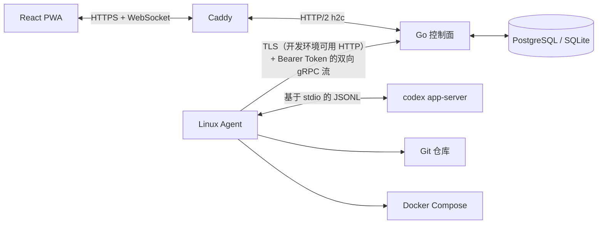

# Wio

Wio 是面向小规模 Linux 服务器集群的个人自托管控制平台。它通过一个响应式 PWA，集中提供服务器注册与维护、Git 项目和工作区管理、Codex app-server 会话、Docker Compose 发布、监控指标、告警、审计以及加密凭据管理。

Wio 的目标规模为单管理员、1-20 台 Linux 服务器和最多约 200 个项目。它不提供任意终端或 Web IDE，也不面向多租户、Kubernetes 或 Windows Agent 场景。控制面本身可以在开发环境运行于 Windows、macOS 或 Linux；Agent 和 Compose 部署只支持 Linux。

## 架构



控制面在同一个端口上提供 HTTP、WebSocket 和 gRPC 服务；生产部署由 Caddy 对外终止 TLS，并通过 h2c 转发到控制面。Agent 主动连接控制面，因此受管服务器在完成 SSH 注册或修复后不需要开放 Wio 入站端口。Agent 链路当前使用 TLS（或本地开发用明文 HTTP）加 Bearer Agent Token 鉴权，仓库内没有客户端证书式 mTLS 配置。

Codex 集成遵循当前的 [Codex app-server 协议](https://learn.chatgpt.com/docs/app-server.md)：Agent 启动 `codex app-server --listen stdio://`，通过 JSONL 完成初始化、线程启动/恢复、任务轮次、通知流和服务端审批请求。Wio 只把受支持的结构化操作下发给 Agent，不提供任意 Shell API。

## 功能特性

- 初始化时可选择三种管理员认证方式：账号 + 固定密码、账号 + 动态验证码或恢复码、账号 + 固定密码 + 动态验证码或恢复码
- 会话与 Agent 令牌哈希、CSRF 防护、严格 Cookie 和登录限流
- 使用 AES-256-GCM Vault 保护 TOTP 密钥和命名部署密钥集
- 使用短期一次性令牌注册或修复 Linux Agent，并支持在线更新服务器凭据
- 采集心跳、CPU、内存、磁盘和网络指标，维护仓库清单并产生阈值告警
- 支持创建空白项目、从远程仓库克隆项目、扫描服务器已有项目，以及关联或创建 Gitee、GitHub、GitLab 远程仓库
- 支持项目置顶、隐藏、归档、重命名、描述和默认分支管理，并提供删除影响预检
- 区分 `managed` 和 `observed` 工作区；支持 Git 状态、分支、远程、提交、fetch/pull/push、stage/unstage/discard/commit 和 worktree 操作
- 支持工作区文件树、文本预览、变更和 diff 预览，以及工作区重命名、移动、同机/跨服务器复制和受管文件删除
- 控制面下发 Agent 更新包，Agent 校验大小与 SHA-256 后原子切换版本，首次启动失败时自动回退
- 实时展示 Codex 消息、命令输出、文件变更、任务状态、中断和审批请求；支持图片输入、消息改写、任务分叉、独立 worktree、目标、MCP、Skills、限额状态和模型/推理强度选择
- 支持在设置中检查并选择稳定的 Codex CLI 版本，并向在线 Agent 下发 Codex CLI 更新
- 使用 Docker Compose 发布目录、健康检查、稳定的 Compose 项目名、部署日志、容器启停/重启/删除和上一版本回滚
- 支持 Vault Secret Set、Codex/Git 凭据预设、外部访问链接、告警确认和审计日志
- 控制面启动时自动注册内置控制机 Agent；该记录由数据库保护，不能被撤销
- 生产环境使用 PostgreSQL，本地开发使用 SQLite
- 可安装的 PWA，并提供离线应用外壳
- 用户界面支持中文和英文，默认使用中文，并在浏览器中保存语言偏好

## 环境要求

控制面开发环境：

- Go 1.22 或更高版本
- Node.js 22 或更高版本
- npm

生产控制面：

- Docker Engine 与 Compose v2
- 指向部署主机的公共域名
- 可供 Caddy 使用的 80 和 443 端口

受管 Agent 主机：

- Linux amd64 或 arm64、systemd 和 SSH
- 控制面注册时使用 `root`，或拥有无需交互输入密码的 `sudo` 的 SSH 用户
- Git、Docker Engine/Compose v2、Node.js/npm 和 Codex CLI 均可选；缺少它们时仍可注册并上报基础状态，相关功能会显示为不可用或警告
- 目标服务器需要能够主动访问控制面的 Agent URL，以及按使用场景访问 Git 远程仓库、Codex API 和 npm/Playwright 下载源

## 运行配置

控制面支持以下环境变量。生产环境至少要设置 `WIO_DATABASE_URL`、`WIO_MASTER_KEY`、`WIO_PUBLIC_URL`（Docker Compose 会根据 `WIO_DOMAIN` 设置）以及数据库密码：

| 变量 | 默认值 | 用途 |
| --- | --- | --- |
| `WIO_ADDR` | `:8080` | 控制面监听地址 |
| `WIO_DATABASE_URL` | `wio.db?_pragma=foreign_keys(1)&_pragma=busy_timeout(5000)` | SQLite DSN 或 PostgreSQL URL |
| `WIO_MASTER_KEY` | 无 | Base64 编码的 32 字节 Vault 主密钥；使用 PostgreSQL 或保存真实密钥时必须显式设置 |
| `WIO_PUBLIC_URL` | 空 | Agent 注册 URL 和对外基址；生产环境应使用 `https://`，它也决定会话 Cookie 是否启用 `Secure` |
| `WIO_DEV_INSECURE` | `false` | 仅本地开发时允许在 HTTPS 基址下关闭 `Secure` Cookie |
| `WIO_AGENT_ASSET_DIR` | `/usr/local/share/wio` | 网页 SSH 注册所使用的 Agent、systemd unit 和依赖助手资产目录 |
| `WIO_CONTROL_AGENT_ENABLED` | Linux 上为 `true` | 是否启动内置控制机 Agent；设为 `false` 后记录仍保留但显示离线 |

内置控制机 Agent 还支持 `WIO_CONTROL_AGENT_URL`、`WIO_CONTROL_AGENT_SCAN_ROOTS`、`WIO_CONTROL_AGENT_CLONE_ROOT`、`WIO_CONTROL_AGENT_STATE_DIR`、`WIO_CONTROL_AGENT_CODEX_PATH`、`WIO_CONTROL_AGENT_CODEX_KEY_FILE`、`WIO_CONTROL_AGENT_DOCKER_PATH`、`WIO_CONTROL_AGENT_PREREQUISITE_SOCKET` 和 `WIO_CONTROL_AGENT_INSECURE_SKIP_VERIFY`。未设置时分别使用本机回环控制面、`/srv,/opt,/home`、`/var/lib/wio-agent/projects`、`/var/lib/wio-agent`、`codex`、`/etc/wio-agent/codex.key`、`docker`、`/run/wio-prerequisites/helper.sock` 和 `false`。最后一个变量只应在开发环境临时使用。

## 本地开发

未设置 `WIO_DATABASE_URL` 和 `WIO_MASTER_KEY` 时，控制面默认使用 `wio.db` 和固定的开发环境 Vault 密钥。不要在开发数据库中保存真实密钥。

```bash
go mod download
npm --prefix web ci
npm --prefix web run build  # 控制面通过 go:embed 需要先存在 web/dist

# 终端 1
go run ./cmd/controlplane

# 终端 2
npm --prefix web run dev
```

打开 [http://127.0.0.1:5173](http://127.0.0.1:5173)。Vite 开发服务器会将 `/api` 和 WebSocket 流量代理到 `http://127.0.0.1:8080`。

构建与测试：

```bash
make build
make test
go vet ./...
npm --prefix web run build
npm --prefix web test
npm --prefix web run typecheck
```

`make build` 会先构建前端，再生成控制面和当前平台的 Agent 二进制。只执行 `go run ./cmd/controlplane` 或直接构建控制面时，干净检出必须先执行一次 `npm --prefix web run build`，否则 `web/embed.go` 找不到 `web/dist`。`make agent-linux` 额外生成 Linux amd64 Agent。`make test` 还会先运行 PostgreSQL 集成迁移测试。

## 生产环境部署控制面

1. 创建生产环境变量文件：

   ```bash
   cp .env.example .env
   # 将两条命令的输出分别写入 .env 中对应的变量
   openssl rand -base64 32  # WIO_MASTER_KEY
   openssl rand -base64 36  # POSTGRES_PASSWORD
   ```

2. 将第一条输出写入 `WIO_MASTER_KEY`，第二条输出写入 `POSTGRES_PASSWORD`。如果密码含有 `@`、`:`、`/`、`?`、`#` 或其他 URL 保留字符，写入 `WIO_DATABASE_URL` 前必须进行 URL 编码；示例中的 `sslmode=disable` 只适用于 Docker Compose 内部网络。

3. 设置 `WIO_DOMAIN` 并启动服务。`WIO_DATABASE_URL` 必须指向 Compose 中的 `postgres` 服务：

   ```bash
   docker compose --env-file .env -f deploy/docker-compose.yml up -d --build
   docker compose --env-file .env -f deploy/docker-compose.yml ps
   ```

4. 打开 `https://<WIO_DOMAIN>`，创建管理员并选择认证方式。选择动态验证码的模式需要扫描 TOTP 二维码并离线保存恢复码；选择固定密码的模式需要妥善保存密码。组合模式登录时必须同时提供固定密码和动态验证码或恢复码。

生产镜像会将 Vite 构建结果嵌入 Go 二进制文件。PostgreSQL 数据、Caddy 证书和 Caddy 状态均使用命名卷保存。

Linux 控制面进程默认同时运行一个内置 Agent，并以固定的“控制机”记录出现在服务器列表中。该记录使用 Vault 保护的持久化令牌，不能通过界面或 API 撤销；将 `WIO_CONTROL_AGENT_ENABLED` 设置为 `false` 可停止内置 Agent 进程，控制机记录会保留为离线状态。

默认 Docker 镜像中的内置 Agent 与控制面处于同一个容器，但镜像不自带 Git、Docker、Codex CLI，也不会自动挂载宿主机项目目录或 Docker socket。因此它默认适合上报容器可见的心跳、指标和状态；若要把控制面所在主机作为可扫描、可部署的完整 Agent，需要以宿主机服务方式运行 Agent，或自行提供相应工具、目录、权限和挂载。其他受管服务器应使用网页注册流程安装独立 Agent。

## 网页注册服务器

生产控制面镜像内置 Linux amd64 和 arm64 两种 Agent。管理员无需在目标服务器手工编译或复制 Agent：

1. 确保目标服务器运行 Linux、systemd 和 SSH，并允许控制面连接 SSH 端口。
2. SSH 用户必须是 `root`，或拥有无需交互输入密码的 `sudo` 权限。
3. 先在“设置”中创建 Codex 凭据预设（服务 URL、模型和 API Key）；可选地创建 Git HTTPS 凭据预设，并填写提交姓名和邮箱。
4. 在 Wio 中打开“服务器”，点击“注册服务器”，填写服务器地址、SSH 用户以及密码或私钥文件，选择 Codex 预设和可选 Git 预设。
5. Wio 首先只读取 SSH 主机公钥，不发送登录凭据。确认页面显示的 SHA-256 指纹后，Wio 才会连接并执行固定的安装流程。

自动注册会创建专用 `wio-agent` 系统用户、安装 Agent 和两个 systemd unit、生成一次性注册令牌并启动服务。目标服务器存在 npm 时，安装器会根据该服务器的公网出口地域自动选择 registry：中国大陆使用 `https://registry.npmmirror.com`，境外或地域识别失败时使用 `https://registry.npmjs.org`；该配置同时写入 `root` 和 `wio-agent` 账户。目标服务器缺少 Codex CLI 但存在 npm 时，安装器会安装当前代码设定的默认 Codex CLI 目标版本（本分支为 `0.144.4`）；同时会尝试安装固定版本的 Playwright CLI（本分支为 `1.61.1`）、Chromium 浏览器及其 Linux 系统依赖。中国大陆服务器的 Chromium 下载使用 `https://npmmirror.com/mirrors/playwright`，其他地区使用官方 CDN，浏览器下载超时为 10 分钟。Playwright 保存在 `/var/lib/wio-agent/playwright`，浏览器文件由 `wio-agent` 持有，安装器会实际启动一次无头 Chromium 完成验收。

Agent 核心安装、注册或配置失败会终止流程；npm、Codex CLI、Playwright、Git 或 Docker 的可选能力失败则在完成页面显示警告，通常不会阻止 Agent 注册。注册时可显式允许 `wio-agent` 与 Codex 免密使用 sudo；该选项会关闭 Agent 服务中阻止提权和系统写入的沙箱限制，并授予 `NOPASSWD: ALL`，应只用于完全信任工作区代码和 Codex 操作的服务器。

Codex provider 配置保存在 `/var/lib/wio-agent/.codex/config.toml`。注册与凭据更新都会保留已有的项目信任和用户自定义字段，并固定写入 `sandbox_mode = "danger-full-access"` 及 `[sandbox_workspace_write].network_access = true`，允许 Codex 在受管项目中修改 Git 元数据（包括 `.git`）并访问包仓库、Git 和外部 API。普通 Agent 的 systemd 单元仍通过 `ProtectSystem=strict`、`ProtectHome=read-only` 和 `ReadWritePaths=/var/lib/wio-agent` 将写入范围限制在 Agent 管理目录；显式启用 Agent sudo 的服务器会放宽该系统级限制，应只用于完全信任工作区代码和 Codex 操作的服务器。API Key 写入目标服务器的 `/etc/wio-agent/codex.key`，权限为 `0600`；控制面不保存 SSH 密码或 SSH 私钥，Codex API Key 与 Git Token 预设仅以 Vault 密文保存，且不会把明文写入审计日志或返回浏览器。Git 预设还会保存非敏感的提交姓名与邮箱，并与 HTTPS 凭据助手一起写入 Agent 的全局 `.gitconfig`。Agent 仅在启动 `codex app-server` 子进程时注入 API Key，Git、扫描和 Docker Compose 子进程不会继承它。

Git 和 Docker 未安装时，服务器仍可注册并上报基础指标，但项目发现、Git 操作和部署功能会在完成页面或服务器列表中显示为不可用。Agent 管理的克隆根目录和发布根目录默认分别为 `/var/lib/wio-agent/projects` 与 `/var/lib/wio-agent/releases`。已有服务器可通过“修复注册”重新安装 Agent、更新 Codex/Git 凭据和部署依赖助手，而无需删除服务器记录。

## 项目与工作区

“项目”页提供三种入口：

- **创建空白项目**：在在线服务器的受管克隆根目录下执行 `git init`，可选择初始分支、README 初始提交，以及关联已有远程仓库。
- **克隆远程仓库**：由 Agent 在受管克隆根目录内执行 Git clone；目标路径不能越出配置的根目录。
- **发现服务器已有项目**：下发 `inventory.scan`，按服务器注册时的扫描根目录搜索 Git 仓库，不复制或修改现有仓库。

空白项目还可以通过已配置的 Git 凭据预设创建 Gitee、GitHub 或 GitLab 远程仓库，远程仓库创建失败时可重试；项目删除不会删除远程仓库。项目支持置顶、隐藏、恢复、归档、描述、默认分支和操作历史。

扫描到的工作区位于 Agent 克隆根目录内时标记为 `managed`，允许 Git 写操作、移动、复制和受管文件删除；其他路径标记为 `observed`，只能查看，不能由 Wio 修改或物理删除。跨服务器复制要求源工作区干净、已检出分支、有 upstream 且 upstream 已登记为项目远程。删除项目或工作区前，Wio 会检查脏文件、活动操作、Codex 任务、子工作区和部署；项目删除可选择仅删除 Wio 元数据，或删除全部受管工作区文件，observed 目录始终保留。

工作区 Git 页面支持状态、ahead/behind、分支、远程和提交查看，以及创建/重命名/删除/切换分支、添加或修改远程、fetch、pull、push、stage、unstage、discard 和 commit。文件树最多返回 4,000 项，文本文件和 diff 预览默认限制为 1 MiB；所有文件路径都会解析并校验在配置的根目录内。

## Agent 发现、升级与 Codex CLI 管理

Agent 每 15 秒上报心跳和资源指标，每 2 分钟重新扫描项目清单。项目发现上限为每次 200 个仓库。生产控制面镜像中的 amd64 和 arm64 Agent 二进制同时作为升级包。服务器表格只会在控制面版本严格高于 Agent、目标在线且该 Agent 支持自更新时启用升级按钮。Agent 使用自己的注册令牌下载对应架构的包，在 `/var/lib/wio-agent/updates` 中完成大小和 SHA-256 校验后原子切换进程；systemd 服务权限不需要放宽。

自更新能力从 `0.2.0` 开始提供；早于该版本的 Agent 无法识别升级操作，需要通过“注册服务器”的 SSH 安装流程重新安装一次。更新后的 Agent 首次连接控制面前如果退出，基础安装版本会在 systemd 重启时自动回退。

设置页可以从 GitHub 查询 `rust-vX.Y.Z` 格式的稳定 Codex CLI 发布，选择目标版本并向在线 Agent 下发更新。Codex CLI 更新要求 Agent 至少为 `0.2.9`，活动任务或其他 Codex 更新进行时不会并发替换 CLI。

## Codex 会话

Codex 会话绑定到工作区。Wio 保存自己的会话 ID、Codex 线程 ID、消息事件和任务状态；Agent 只在需要时启动或恢复对应的 app-server 线程。页面支持：

- 流式消息、命令调用和文件变更展示，以及中断正在运行的任务
- 最多 4 张 PNG、JPEG 或 WebP 图片输入，单张最多 2 MiB、总计最多 4 MiB
- 编辑较早消息并重写后续历史、继续到新任务、创建永久 Git worktree 并在新 worktree 中继续
- `on-request`、不信任命令和从不批准等审批策略，以及页面内批准/拒绝服务端请求
- 模型覆盖、推理强度、任务目标和 token budget
- 工作区级 MCP 服务器与 Skills 列表，线程级 Codex 限额状态
- 归档/恢复和删除会话；归档会话为只读

目标、MCP、Skills、限额和计划模式是按 Agent 上报的 Codex 版本能力显示的；如果 app-server 不支持某项能力，Wio 会展示“不支持”，不会用提示词模拟该能力。Codex API Key 只注入 `codex app-server` 子进程，Git、扫描和 Docker Compose 子进程不会继承该变量。

## 部署流程

1. 创建包含 `KEY=value` 环境变量的 Vault 密钥集。
2. 为项目、服务器和环境创建部署目标。
3. 部署目标可选择目标服务器上的已有项目工作区，或直接填写远程 Git 仓库；内部发布目录由 Wio 管理，无需手动配置。
4. Agent 会在创建 release 前检查 Linux、Git、Docker daemon、Docker Compose、发布目录权限，并在已有项目模式下验证工作区与 Compose 文件。缺失 Git、Docker、Compose 或 Docker 服务未启动时，会在支持 `apt-get`、`dnf` 或 `yum` 的服务器上自动执行固定的安装和启动步骤，完整输出保存在部署日志中，随后重新检查环境。首次使用此功能的既有 Agent 需要在“服务器”页重新注册一次，以安装仅限部署依赖的受限 root 助手；之后无需授予 Agent 或 Codex sudo 权限。
5. 选择 `build` 执行 `docker compose up -d --build`，或选择 `pull` 在启动服务前拉取镜像。
6. 添加 HTTP(S) URL 或 TCP `host:port` 健康检查。HTTP 2xx/3xx 或成功建立 TCP 连接视为健康，默认在 60 秒内每 2 秒重试。
7. 部署配置的 Git 引用。Wio 会解析并记录准确的提交哈希。
8. 部署完成后可在目标操作菜单中启动、停止、重启或删除 Compose 容器。删除操作执行 `docker compose down --remove-orphans`，保留命名卷、发布目录和部署历史，之后仍可从当前发布重新启动。
9. 在部署目标的操作菜单中回滚到上一个成功版本。

部署目标的“外部访问 URL”只用于在目标和成功部署记录中显示可点击链接；Wio 不会据此创建反向代理、开放防火墙或修改 Compose 端口。相关网络和 DNS 必须由 Compose、主机或外部代理自行配置。

包含环境密钥的部署和容器操作载荷会作为 Vault 密文存储在 `agent_operations` 中，仅在通过已认证的 gRPC 连接发送时解密。事件和部署输出会在持久化与广播前进行脱敏。部署日志单条命令输出最多保留 1 MiB，同一目标不会并发执行部署或容器生命周期操作。

## 监控与告警

Agent 每 15 秒采集 CPU、内存、根文件系统磁盘占用、1 分钟负载以及累计网络收发字节，控制面按分钟聚合。监控页支持 1 小时、6 小时、24 小时和 7 天视图。

CPU、内存或磁盘占用连续 3 个样本达到 90% 时创建告警；CPU/内存告警为 `warning`，磁盘告警为 `critical`。指标回落后开放告警会自动标记为已解决，管理员也可以单独确认告警。设置页最多展示最近 500 条审计记录。

## 备份与恢复

以下内容必须一起备份：

- PostgreSQL 数据库
- `WIO_MASTER_KEY`
- Caddy 的 `caddy_data` 和 `caddy_config` 数据卷
- 每台 Agent 的 `/etc/wio-agent/config.json`、`/etc/wio-agent/codex.key` 和 `/var/lib/wio-agent`，如果不希望重新注册或重新下载受管工具；这些内容包含 Agent Token、API Key 或运行状态，必须加密保存
- 保存生产变量的 `.env` 或等价密钥管理记录；其中包含数据库密码和 Vault 主密钥，必须加密保存

数据库备份示例：

```bash
docker compose --env-file .env -f deploy/docker-compose.yml exec -T postgres \
  pg_dump -U wio -Fc wio > wio.dump
```

使用 SQLite 时还应备份 `wio.db`；复制前应先停止控制面，或使用 SQLite 在线备份工具，避免只复制正在写入的数据库主文件。

丢失 `WIO_MASTER_KEY` 后，启用动态验证码的管理员 TOTP 密钥、Codex/Git 凭据预设、Vault 密钥集、内置控制机 Agent Token 和等待执行的加密部署/容器操作都将无法恢复。请将该密钥保存在 Docker 主机备份之外的安全位置。

## 安全边界

- Wio 面向可信的单管理员环境。
- 固定密码最少 12 个字符并使用 Argon2id 哈希；启用 TOTP 时会生成 10 个一次性恢复码。组合模式要求密码和 TOTP/恢复码同时通过。
- 会话默认有效期为 7 天，Cookie 使用 `HttpOnly`、`SameSite=Strict`，生产 HTTPS 下启用 `Secure`；非 GET 请求必须携带 CSRF Token。单个来源地址连续 5 次登录失败后会被限制 5 分钟。
- 普通 Agent 令牌和注册令牌只在签发时使用一次，控制面仅保存其哈希值；内置控制机 Agent 的持久令牌是例外，还会以 Vault 密文保存在 `control_settings` 中，以便控制面重启后恢复连接。Agent 与控制面之间使用 Bearer Token 鉴权。TLS 负责链路加密，当前没有客户端证书式 mTLS。
- SSH 主机指纹必须经过确认；SSH 密码和私钥仅在单次注册请求内使用，不写入控制面数据库。
- Vault 密钥集及服务器凭据预设保存后，浏览器不会再次收到其中的明文；Codex API Key 与 Git Token 只以 Vault 密文写入数据库。
- 默认 Agent systemd 服务启用 `NoNewPrivileges`、只读系统和受限 Home；只有显式勾选 Agent sudo 时才会放宽这些限制并写入 `NOPASSWD: ALL`。
- SSH 引导程序只执行内置安装步骤；部署依赖 root 助手只接受固定的 `ensure` 动作和固定软件包集合。Git 和 Compose 均通过结构化参数调用，Wio 不提供任意 Shell 操作 API。
- Agent 导入目标、工作区文件操作和发布路径必须位于配置的根目录内，并在符号链接解析后再次检查边界。
- Agent 更新包只能由已注册 Agent 下载，且执行前必须匹配控制面下发的架构、大小和 SHA-256。
- 明文 HTTP 仅用于本地开发，生产环境必须使用 Caddy 或同等的 TLS 代理。
- Docker 组权限实际上等同于 root。请使用专用系统账号，并严格限制其配置文件的访问权限。

## 仓库结构

```text
cmd/controlplane          控制面可执行程序
cmd/agent                 Linux Agent 可执行程序
proto/agent.proto         Agent 双向流的公开消息契约；Go 实现使用 JSON gRPC codec
internal/agent            Agent 连接、操作调度、凭据和自更新
internal/httpapi          身份认证与浏览器 API
internal/agentgateway     已认证的双向 gRPC 网关
internal/codexadapter     Codex app-server JSONL 适配器
internal/codexcli         Codex CLI 版本发现与版本比较
internal/codexconfig      Codex provider 和 sandbox 配置合并
internal/gitrepository    结构化 Git 仓库读写与生命周期
internal/gitworktree      Git worktree 创建与清理
internal/gitprovider      Gitee、GitHub 和 GitLab 远程仓库创建
internal/deployer         Git release 与 Docker Compose 生命周期
internal/prerequisite     受限的部署依赖 root 助手
internal/scanner          Git 仓库发现与导入
internal/store            PostgreSQL/SQLite 数据结构与查询
internal/sshbootstrap     SSH 指纹探测、Agent 安装与修复
internal/security         密码、令牌、Vault 和脱敏
internal/realtime         浏览器 WebSocket 事件广播
web                       React/TypeScript PWA 与嵌入式构建产物
deploy                    Caddy、Compose、Dockerfile 和 systemd unit
docs                      项目管理计划与验收记录
```
