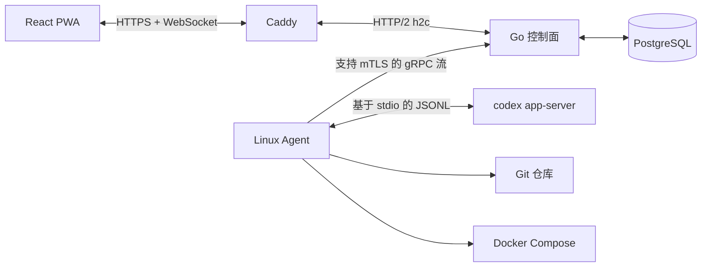

# Wio

Wio 是面向小规模 Linux 服务器集群的个人自托管控制平台。它通过一个响应式 PWA，集中提供服务器与 Git 仓库发现、Codex app-server 会话、Docker Compose 发布、监控指标、告警以及加密部署密钥管理。

Wio 的目标规模为单管理员、1-20 台 Linux 服务器和最多约 200 个项目。它不提供任意终端或 Web IDE，也不面向多租户、Kubernetes 或 Windows Agent 场景。

## 架构



控制面在同一个端口上提供 HTTP、WebSocket 和 gRPC 服务，生产环境由 Caddy 终止 TLS。Agent 主动连接控制面，因此受管服务器不需要对外开放 Wio 入站端口。

Codex 集成遵循当前的 [Codex app-server 协议](https://learn.chatgpt.com/docs/app-server.md)：完成一次初始化后，启动或恢复线程、启动任务轮次、流式传输通知，并响应服务端发起的审批请求。

## 功能特性

- 单管理员密码加 TOTP 认证，并提供一次性恢复码
- Argon2id 密码哈希、会话与 Agent 令牌哈希、CSRF 防护、严格 Cookie 和登录限流
- 使用 AES-256-GCM Vault 保护 TOTP 密钥和命名部署密钥集
- 使用短期一次性令牌注册 Linux Agent
- 采集心跳、CPU、内存、磁盘和网络指标，维护仓库清单并产生阈值告警
- 自动发现 Git 仓库，并将导入路径限制在 Agent 克隆根目录内
- 实时展示 Codex 消息、命令输出、文件变更、任务状态、中断和审批请求
- 使用 Docker Compose 发布目录、健康检查、稳定的 Compose 项目名和上一版本回滚
- 生产环境使用 PostgreSQL，本地开发使用 SQLite
- 可安装的 PWA，并提供离线应用外壳
- 用户界面支持中文和英文，默认使用中文，并在浏览器中保存语言偏好

## 环境要求

控制面开发环境：

- Go 1.22 或更高版本
- Node.js 22 或更高版本
- npm

生产控制面：

- Docker Engine 与 Compose v2
- 指向部署主机的公共域名
- 可供 Caddy 使用的 80 和 443 端口

受管 Agent 主机：

- Linux
- Git
- Docker Engine 与 Compose v2，用于执行部署
- 已为 `wio-agent` 服务账号安装并登录 Codex CLI

## 本地开发

未设置 `WIO_DATABASE_URL` 和 `WIO_MASTER_KEY` 时，控制面默认使用 `wio.db` 和固定的开发环境 Vault 密钥。不要在开发数据库中保存真实密钥。

```bash
go mod download
npm --prefix web install

# 终端 1
go run ./cmd/controlplane

# 终端 2
npm --prefix web run dev
```

打开 [http://127.0.0.1:5173](http://127.0.0.1:5173)。Vite 开发服务器会将 `/api` 和 WebSocket 流量代理到 `http://127.0.0.1:8080`。

构建与测试：

```bash
make test
npm --prefix web run build
go build ./cmd/controlplane ./cmd/agent
```

## 生产环境部署控制面

1. 创建生产环境变量文件：

   ```bash
   cp .env.example .env
   openssl rand -base64 32
   openssl rand -base64 36
   ```

2. 将第一条命令的输出写入 `WIO_MASTER_KEY`。使用第二条命令的输出作为 PostgreSQL 密码，并在写入 `WIO_DATABASE_URL` 前进行 URL 编码。

3. 设置 `WIO_DOMAIN` 并启动服务：

   ```bash
   docker compose --env-file .env -f deploy/docker-compose.yml up -d --build
   docker compose --env-file .env -f deploy/docker-compose.yml ps
   ```

4. 打开 `https://<WIO_DOMAIN>`，创建管理员，扫描 TOTP 二维码，并离线保存恢复码。

生产镜像会将 Vite 构建结果嵌入 Go 二进制文件。PostgreSQL 数据、Caddy 证书和 Caddy 状态均使用命名卷保存。

## 安装 Agent

在任意 Go 主机上构建 Linux 二进制文件：

```bash
make agent-linux
sudo install -m 0755 bin/wio-agent-linux-amd64 /usr/local/bin/wio-agent
```

在受管服务器上执行：

```bash
sudo useradd --system --home /var/lib/wio-agent --create-home --shell /usr/sbin/nologin wio-agent
sudo usermod -aG docker wio-agent
sudo install -m 0644 deploy/agent.service /etc/systemd/system/wio-agent.service
```

在 Wio 中打开“服务器”，创建注册令牌，然后以 root 身份执行界面显示的命令。生成的 `/etc/wio-agent/config.json` 文件权限为 `0600`。

启动 systemd 服务前，需要以服务账号登录 Codex。使用默认 unit 时，Codex 状态保存在 `/var/lib/wio-agent/.codex`：

```bash
sudo -u wio-agent -H env HOME=/var/lib/wio-agent codex login
sudo systemctl daemon-reload
sudo systemctl enable --now wio-agent
sudo journalctl -u wio-agent -f
```

Agent 管理的克隆根目录和发布根目录默认分别为 `/var/lib/wio-agent/projects` 与 `/var/lib/wio-agent/releases`。systemd unit 仅允许服务写入 `/var/lib/wio-agent` 目录。

## 部署流程

1. 创建包含 `KEY=value` 环境变量的 Vault 密钥集。
2. 为项目、服务器和环境创建部署目标。
3. 选择 `build` 执行 `docker compose up -d --build`，或选择 `pull` 在启动服务前拉取镜像。
4. 添加 HTTP(S) URL 或 TCP `host:port` 健康检查。
5. 部署配置的 Git 引用。Wio 会解析并记录准确的提交哈希。
6. 在部署目标的操作菜单中回滚到上一个成功版本。

包含环境密钥的部署命令载荷会作为 Vault 密文存储在 `agent_operations` 中，仅在通过已认证的 gRPC 连接发送时解密。事件和部署输出会在持久化与广播前进行脱敏。

## 备份与恢复

以下内容必须一起备份：

- PostgreSQL 数据库
- `WIO_MASTER_KEY`
- Caddy 数据卷
- Agent 配置文件，如果不希望重新注册 Agent

数据库备份示例：

```bash
docker compose --env-file .env -f deploy/docker-compose.yml exec -T postgres \
  pg_dump -U wio -Fc wio > wio.dump
```

丢失 `WIO_MASTER_KEY` 后，TOTP 密钥、Vault 密钥集和等待执行的加密部署操作都将无法恢复。请将该密钥保存在 Docker 主机备份之外的安全位置。

## 安全边界

- Wio 面向可信的单管理员环境。
- Agent 令牌和注册令牌只显示一次，控制面仅保存其哈希值。
- Vault 密钥集保存后，浏览器不会再次收到其中的明文。
- Git 和 Compose 均通过参数数组调用；Wio 不提供任意 Shell 操作 API。
- Agent 导入目标和发布路径必须位于配置的根目录内。
- 明文 HTTP 仅用于本地开发，生产环境必须使用 Caddy 或同等的 TLS 代理。
- Docker 组权限实际上等同于 root。请使用专用系统账号，并严格限制其配置文件的访问权限。

## 仓库结构

```text
cmd/controlplane          控制面可执行程序
cmd/agent                 Linux Agent 可执行程序
internal/httpapi          身份认证与浏览器 API
internal/agentgateway     已认证的双向 gRPC 网关
internal/codexadapter     Codex app-server JSONL 适配器
internal/deployer         Git 发布与 Docker Compose 生命周期
internal/scanner          Git 仓库发现与导入
internal/store            PostgreSQL/SQLite 数据结构与查询
web                       React/TypeScript PWA 与嵌入式构建产物
deploy                    Caddy、Compose、Dockerfile 和 systemd unit
work/codex-schema         Codex 0.139.0 协议生成结果
```
