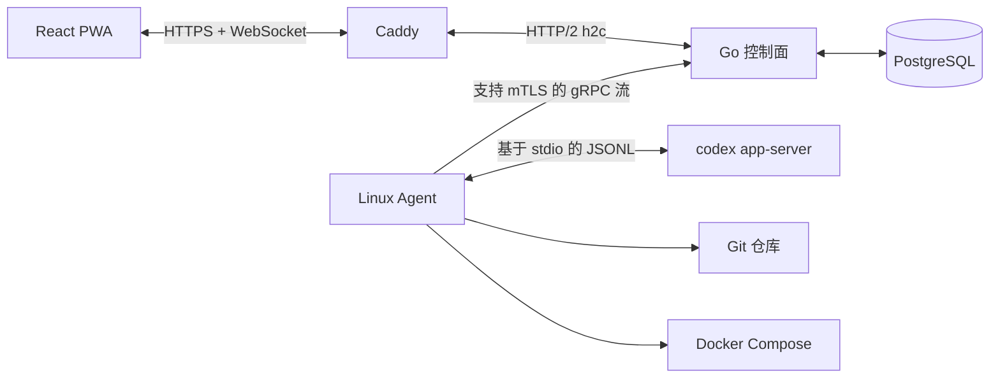

# Wio

Wio 是面向小规模 Linux 服务器集群的个人自托管控制平台。它通过一个响应式 PWA，集中提供服务器与 Git 仓库发现、Codex app-server 会话、Docker Compose 发布、监控指标、告警以及加密部署密钥管理。

Wio 的目标规模为单管理员、1-20 台 Linux 服务器和最多约 200 个项目。它不提供任意终端或 Web IDE，也不面向多租户、Kubernetes 或 Windows Agent 场景。

## 架构



控制面在同一个端口上提供 HTTP、WebSocket 和 gRPC 服务，生产环境由 Caddy 终止 TLS。Agent 主动连接控制面，因此受管服务器不需要对外开放 Wio 入站端口。

Codex 集成遵循当前的 [Codex app-server 协议](https://learn.chatgpt.com/docs/app-server.md)：完成一次初始化后，启动或恢复线程、启动任务轮次、流式传输通知，并响应服务端发起的审批请求。

## 功能特性

- 单管理员用户名加 TOTP 认证，并提供一次性恢复码；登录不再需要密码
- 会话与 Agent 令牌哈希、CSRF 防护、严格 Cookie 和登录限流
- 使用 AES-256-GCM Vault 保护 TOTP 密钥和命名部署密钥集
- 使用短期一次性令牌注册 Linux Agent
- 采集心跳、CPU、内存、磁盘和网络指标，维护仓库清单并产生阈值告警
- 自动发现 Git 仓库，并将导入路径限制在 Agent 克隆根目录内
- 可从项目页指定在线服务器，立即触发 Agent 扫描并导入该服务器已有的 Git 项目
- 控制面下发 Agent 更新包，Agent 校验大小与 SHA-256 后原子切换版本，首次启动失败时自动回退
- 实时展示 Codex 消息、命令输出、文件变更、任务状态、中断和审批请求
- 使用 Docker Compose 发布目录、健康检查、稳定的 Compose 项目名和上一版本回滚
- 生产环境使用 PostgreSQL，本地开发使用 SQLite
- 可安装的 PWA，并提供离线应用外壳
- 用户界面支持中文和英文，默认使用中文，并在浏览器中保存语言偏好

## 环境要求

控制面开发环境：

- Go 1.22 或更高版本
- Node.js 22 或更高版本
- npm

生产控制面：

- Docker Engine 与 Compose v2
- 指向部署主机的公共域名
- 可供 Caddy 使用的 80 和 443 端口

受管 Agent 主机：

- Linux
- Git
- Docker Engine 与 Compose v2，用于执行部署
- 已为 `wio-agent` 服务账号安装并登录 Codex CLI

## 本地开发

未设置 `WIO_DATABASE_URL` 和 `WIO_MASTER_KEY` 时，控制面默认使用 `wio.db` 和固定的开发环境 Vault 密钥。不要在开发数据库中保存真实密钥。

```bash
go mod download
npm --prefix web install

# 终端 1
go run ./cmd/controlplane

# 终端 2
npm --prefix web run dev
```

打开 [http://127.0.0.1:5173](http://127.0.0.1:5173)。Vite 开发服务器会将 `/api` 和 WebSocket 流量代理到 `http://127.0.0.1:8080`。

构建与测试：

```bash
make test
npm --prefix web run build
go build ./cmd/controlplane ./cmd/agent
```

## 生产环境部署控制面

1. 创建生产环境变量文件：

   ```bash
   cp .env.example .env
   openssl rand -base64 32
   openssl rand -base64 36
   ```

2. 将第一条命令的输出写入 `WIO_MASTER_KEY`。使用第二条命令的输出作为 PostgreSQL 密码，并在写入 `WIO_DATABASE_URL` 前进行 URL 编码。

3. 设置 `WIO_DOMAIN` 并启动服务：

   ```bash
   docker compose --env-file .env -f deploy/docker-compose.yml up -d --build
   docker compose --env-file .env -f deploy/docker-compose.yml ps
   ```

4. 打开 `https://<WIO_DOMAIN>`，创建管理员，扫描 TOTP 二维码，并离线保存恢复码。登录时只需要用户名和动态验证码；恢复码可作为一次性备用登录凭据。

生产镜像会将 Vite 构建结果嵌入 Go 二进制文件。PostgreSQL 数据、Caddy 证书和 Caddy 状态均使用命名卷保存。

## 网页注册服务器

生产控制面镜像内置 Linux amd64 和 arm64 两种 Agent。管理员无需在目标服务器手工编译或复制 Agent：

1. 确保目标服务器运行 Linux、systemd 和 SSH，并允许控制面连接 SSH 端口。
2. SSH 用户必须是 `root`，或拥有无需交互输入密码的 `sudo` 权限。
3. 在 Wio 中打开“服务器”，点击“注册服务器”。
4. 填写服务器地址、SSH 用户以及密码或私钥文件。
5. 填写 Codex API URL、API Key 和模型。API URL 可以使用 OpenAI 官方地址，也可以使用兼容 Responses API 的自定义网关。
6. Wio 首先只读取 SSH 主机公钥，不发送登录凭据。确认页面显示的 SHA-256 指纹后，Wio 才会连接并执行固定的安装流程。

自动注册会创建专用 `wio-agent` 系统用户、安装 Agent 和 systemd unit、生成一次性注册令牌并启动服务。目标服务器存在 npm 时，安装器会根据该服务器的公网出口地域自动选择 registry：中国大陆使用 `https://registry.npmmirror.com`，境外或地域识别失败时使用 `https://registry.npmjs.org`；该配置同时写入 `root` 和 `wio-agent` 账户。目标服务器缺少 Codex CLI 但存在 npm 时，安装器会自动安装与当前适配器匹配的 Codex CLI 版本，并安装固定版本的 Playwright CLI、Chromium 浏览器及其 Linux 系统依赖；中国大陆服务器的 Chromium 下载使用 `https://npmmirror.com/mirrors/playwright`，其他地区使用官方 CDN，下载均设置 10 分钟超时。Playwright 保存在 `/var/lib/wio-agent/playwright`，浏览器文件由 `wio-agent` 持有，安装器会实际启动一次无头 Chromium 完成验收；任一阶段失败都会在注册结果中显示明确警告，但不会阻止 Agent 注册。注册时可显式允许 `wio-agent` 与 Codex 免密使用 sudo；该选项会关闭 Agent 服务中阻止提权和系统写入的沙箱限制，并授予 `NOPASSWD: ALL`，应只用于完全信任工作区代码和 Codex 操作的服务器。

Codex provider 配置保存在 `/var/lib/wio-agent/.codex/config.toml`。注册与凭据更新都会保留已有的项目信任和用户自定义字段，并固定写入 `sandbox_mode = "workspace-write"` 及 `[sandbox_workspace_write].network_access = true`，允许 Codex 工作区命令访问包仓库、Git 和外部 API。API Key 写入目标服务器的 `/etc/wio-agent/codex.key`，权限为 `0600`；控制面不保存 SSH 密码或 SSH 私钥，Codex API Key 与 Git Token 预设仅以 Vault 密文保存，且不会把明文写入审计日志或返回浏览器。Git 预设还会保存非敏感的提交姓名与邮箱，并与 HTTPS 凭据助手一起写入 Agent 的全局 `.gitconfig`。Agent 仅在启动 `codex app-server` 子进程时注入 API Key，Git、扫描和 Docker Compose 子进程不会继承它。

Git 和 Docker 未安装时，服务器仍可注册并上报基础指标，但项目发现和部署功能会在完成页面中显示为不可用。Agent 管理的克隆根目录和发布根目录默认分别为 `/var/lib/wio-agent/projects` 与 `/var/lib/wio-agent/releases`。

## 项目发现与 Agent 升级

在“项目”页选择“服务器已有项目”并指定在线服务器后，控制面会下发 `inventory.scan` 操作。Agent 按注册时配置的扫描根目录搜索 Git 仓库，结果仍通过既有清单链路写入项目和工作区，不会复制或修改仓库。

生产控制面镜像中的 amd64 和 arm64 Agent 二进制同时作为升级包。服务器表格只会在控制面版本严格高于 Agent、目标在线且该 Agent 支持自更新时启用升级按钮。Agent 使用自己的注册令牌下载对应架构的包，在 `/var/lib/wio-agent/updates` 中完成大小和 SHA-256 校验后原子切换进程；systemd 服务权限不需要放宽。

自更新能力从 `0.2.0` 开始提供。早于该版本的 Agent 无法识别升级操作，需要通过“注册服务器”的 SSH 安装流程重新安装一次；以后即可使用远程升级。更新后的 Agent 首次连接控制面前如果退出，基础安装版本会在 systemd 重启时自动回退。

## 部署流程

1. 创建包含 `KEY=value` 环境变量的 Vault 密钥集。
2. 为项目、服务器和环境创建部署目标。
3. 部署目标可选择目标服务器上的已有项目工作区，或直接填写远程 Git 仓库；内部发布目录由 Wio 管理，无需手动配置。
4. Agent 会在创建 release 前检查 Linux、Git、Docker daemon、Docker Compose、发布目录权限，并在已有项目模式下验证工作区与 Compose 文件。缺失 Git、Docker、Compose 或 Docker 服务未启动时，会在支持 `apt-get`、`dnf` 或 `yum` 的服务器上自动执行固定的安装和启动步骤，完整输出保存在部署日志中，随后重新检查环境。首次使用此功能的既有 Agent 需要在“服务器”页重新注册一次，以安装仅限部署依赖的受限 root 助手；之后无需授予 Agent 或 Codex sudo 权限。
5. 选择 `build` 执行 `docker compose up -d --build`，或选择 `pull` 在启动服务前拉取镜像。
6. 添加 HTTP(S) URL 或 TCP `host:port` 健康检查。
7. 部署配置的 Git 引用。Wio 会解析并记录准确的提交哈希。
8. 在部署目标的操作菜单中回滚到上一个成功版本。

包含环境密钥的部署命令载荷会作为 Vault 密文存储在 `agent_operations` 中，仅在通过已认证的 gRPC 连接发送时解密。事件和部署输出会在持久化与广播前进行脱敏。

## 备份与恢复

以下内容必须一起备份：

- PostgreSQL 数据库
- `WIO_MASTER_KEY`
- Caddy 数据卷
- Agent 配置文件，如果不希望重新注册 Agent

数据库备份示例：

```bash
docker compose --env-file .env -f deploy/docker-compose.yml exec -T postgres \
  pg_dump -U wio -Fc wio > wio.dump
```

丢失 `WIO_MASTER_KEY` 后，TOTP 密钥、Vault 密钥集和等待执行的加密部署操作都将无法恢复。请将该密钥保存在 Docker 主机备份之外的安全位置。

## 安全边界

- Wio 面向可信的单管理员环境。
- 管理员登录仅校验 TOTP 或一次性恢复码；TOTP 密钥或任一未使用恢复码泄露即等同于管理员凭据泄露。
- Agent 令牌和注册令牌只显示一次，控制面仅保存其哈希值。
- SSH 主机指纹必须经过确认；SSH 密码和私钥仅在单次注册请求内使用，不写入控制面数据库。
- Vault 密钥集及服务器凭据预设保存后，浏览器不会再次收到其中的明文；Codex API Key 与 Git Token 只以 Vault 密文写入数据库。
- SSH 引导程序只能执行内置的 Agent 安装步骤；Git 和 Compose 均通过参数数组调用，Wio 不提供任意 Shell 操作 API。
- Agent 导入目标和发布路径必须位于配置的根目录内。
- Agent 更新包只能由已注册 Agent 下载，且执行前必须匹配控制面下发的架构、大小和 SHA-256。
- 明文 HTTP 仅用于本地开发，生产环境必须使用 Caddy 或同等的 TLS 代理。
- Docker 组权限实际上等同于 root。请使用专用系统账号，并严格限制其配置文件的访问权限。

## 仓库结构

```text
cmd/controlplane          控制面可执行程序
cmd/agent                 Linux Agent 可执行程序
internal/httpapi          身份认证与浏览器 API
internal/agentgateway     已认证的双向 gRPC 网关
internal/codexadapter     Codex app-server JSONL 适配器
internal/deployer         Git 发布与 Docker Compose 生命周期
internal/scanner          Git 仓库发现与导入
internal/store            PostgreSQL/SQLite 数据结构与查询
web                       React/TypeScript PWA 与嵌入式构建产物
deploy                    Caddy、Compose、Dockerfile 和 systemd unit
work/codex-schema         Codex 0.139.0 协议生成结果
```
