# Wio 用户使用手册

> 适用版本：Wio 0.2.x
>
> 更新日期：2026-08-04

Wio 是面向小规模 Linux 服务器集群的自托管运维控制台。它把服务器注册、项目与工作区管理、Git 操作、Codex 会话、Docker Compose 部署、资源监控、告警、凭据和审计集中在一个 Web 界面中。

本手册从管理员日常使用的角度说明各项功能。安装控制面、配置 PostgreSQL、配置域名和 TLS 等部署问题，请结合 [生产部署说明](PRODUCTION_DEPLOYMENT.md) 阅读。

## 1. 使用前须知

### 1.1 Wio 管理的对象

| 对象 | 用户视角下的含义 | 常见用途 |
| --- | --- | --- |
| 服务器 | 一台已注册到 Wio 的 Linux 主机。Agent 在主机上运行并执行受支持的结构化操作。 | 扫描项目、执行 Git、运行 Codex、执行部署、上报指标 |
| 控制机 | Wio 控制面自带的内置 Agent 记录。 | 本地开发、控制面自身的状态展示和测试 |
| 项目 | 一个逻辑项目或仓库，属于 Wio 中的管理对象。 | 统一管理远程仓库、工作区、Codex 会话和部署 |
| 工作区 | 项目在某台服务器上的实际目录或 Git checkout。一个项目可以有多个工作区。 | 开发目录、生产目录、观察到的既有仓库 |
| 受管工作区 | 由 Wio 创建或复制，Wio 可以按权限执行路径移动、复制和删除。 | 适合由 Wio 全生命周期管理的项目 |
| 观察工作区 | Wio 扫描到的既有目录，文件由用户或其他系统管理。 | 纳管现有服务器项目，默认更保守、更偏只读 |
| 凭据预设 | 加密保存的 Codex API 或 Git HTTPS 凭据。 | 注册服务器、访问私有仓库、启动 Codex |
| Vault 密钥集 | 供 Compose 部署注入的环境变量集合。 | 数据库密码、API Token、应用配置等部署密钥 |
| 部署目标 | 项目在某个环境、服务器和工作区上的部署配置。 | production、staging 等环境的重复部署 |

### 1.2 主导航

登录后左侧主导航包含以下页面：

- **总览**：查看服务器、项目、Codex 会话、进行中部署和未解决告警的摘要。
- **服务器**：注册 Linux 服务器，查看在线状态、Agent/Codex 版本、已绑定凭据和能力告警。
- **项目**：创建或导入项目，管理项目详情、工作区和 Git 信息。
- **Codex**：选择工作区，创建会话并与 Codex 交互。
- **部署**：创建部署目标，发起部署，查看容器状态、部署日志和历史。
- **监控**：查看服务器指标、操作延迟、告警和告警确认状态。
- **设置**：管理 Codex CLI 版本、定时任务、凭据预设、Vault 密钥集和审计日志。

右上角的 **中文 / EN** 用于切换界面语言；旁边的 **实时连接** 表示控制面与浏览器的实时事件连接状态。右下角显示当前管理员账号，点击退出图标即可注销。

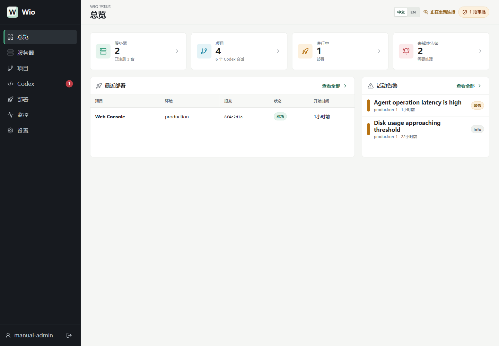

### 1.3 操作状态怎么理解

Wio 的服务器操作、项目导入、Git 操作、Codex 会话和部署通常由 Agent 异步执行。点击按钮后看到“已排队”或 `queued`，表示请求已经保存并等待可用 Agent，不代表操作已经完成。

建议按下面的顺序判断结果：

1. **queued**：请求已保存，等待交付给在线 Agent。
2. **delivered**：请求已交给 Agent，尚未等同于执行成功。
3. **running**：Agent 正在执行，等待实时事件或日志。
4. **succeeded**：操作成功完成。
5. **failed / interrupted / cancelled / rolled back**：操作已经结束但未按原目标完成，需要先看错误信息或部署日志，再决定是否重试。

同一工作区的写操作会串行执行。看到操作正在进行时不要重复点击提交；先确认服务器在线并观察对应记录的状态变化。

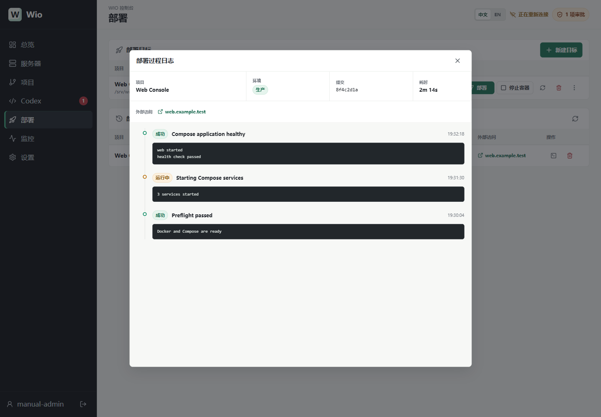

> 截图说明：本手册中的截图来自当前版本的隔离验收环境。部分页面使用空数据或示例数据，空状态表示当前没有资源，不表示功能不可用；项目名、路径和仓库地址仅用于说明界面。

## 2. 首次登录

### 2.1 创建管理员

第一次打开 Wio 时会进入“创建管理员”页面。Wio 是单管理员控制台，首次配置完成后不能再通过页面创建第二个管理员。

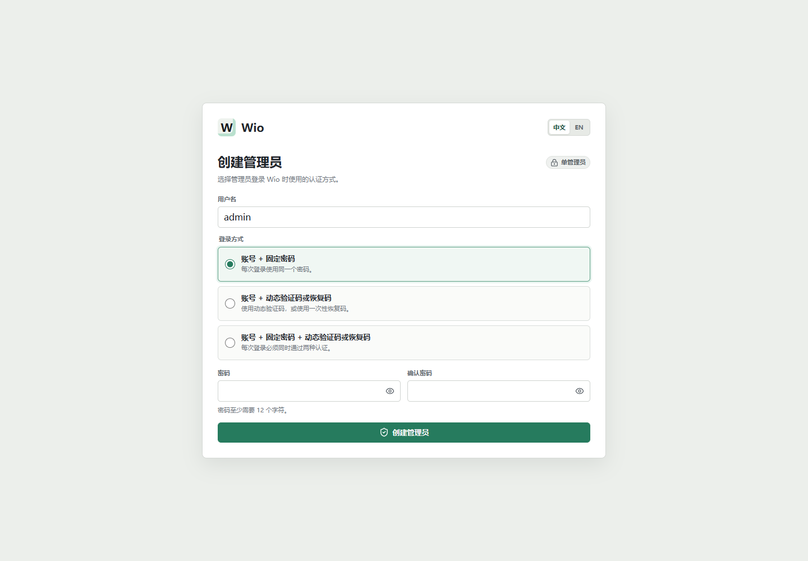

按以下步骤完成初始化：

1. 输入管理员用户名。默认值为 `admin`，也可以在创建前修改。
2. 选择登录方式：
   - **账号 + 固定密码**：每次使用用户名和固定密码登录。
   - **账号 + 动态验证码或恢复码**：使用认证器动态验证码，或使用一次性恢复码登录。
   - **账号 + 固定密码 + 动态验证码或恢复码**：每次登录都需要密码和第二因素。
3. 如果选择包含固定密码的方式，输入至少 12 个字符的密码并确认。
4. 点击 **创建管理员**。

使用动态验证码时，创建完成页面会显示二维码、TOTP 密钥和恢复码。使用认证器扫描二维码后，立即将恢复码保存到服务器之外的安全位置。每个恢复码只能使用一次，不能把它当作可重复使用的密码。

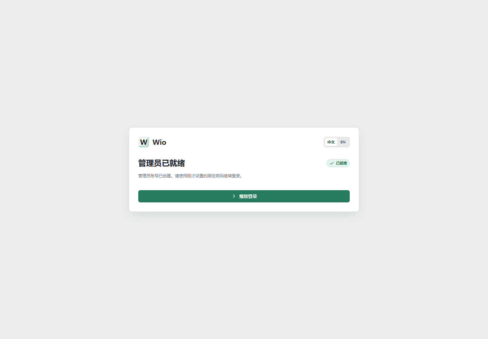

### 2.2 登录和注销

创建完成后点击 **继续登录**，输入管理员账号和所选认证信息。

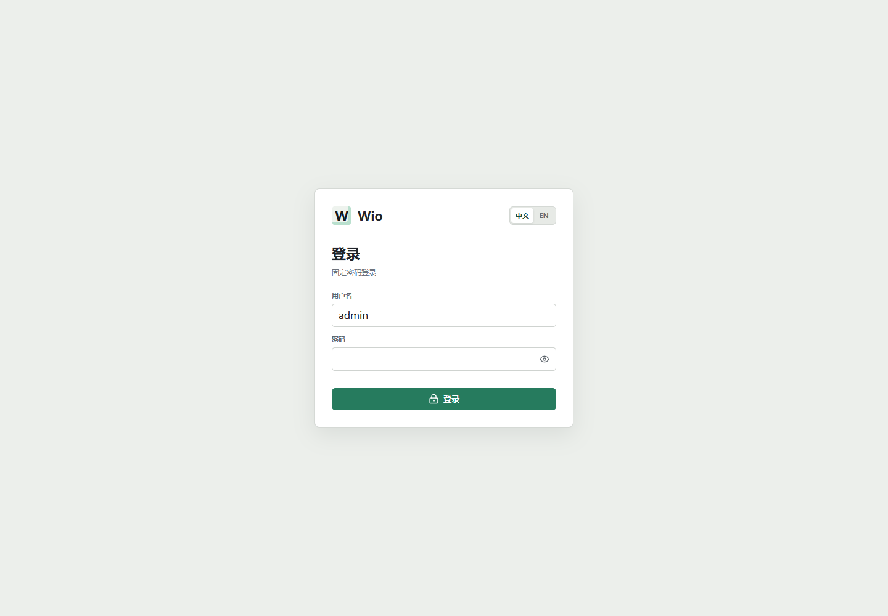

登录后：

- 看到 **实时连接** 后，页面可以接收 Agent、Codex 和部署事件。
- 如果显示 **重新连接**，页面仍可查看部分已缓存数据，但不要在重要写操作上连续重复点击。先恢复网络或检查控制面服务。
- 退出登录使用左侧底部的退出图标。生产环境不建议在共享浏览器中长期保持管理员会话。

## 3. 推荐的首次配置顺序

建议按以下顺序配置，能减少“服务器已经注册但 Codex 或私有仓库不可用”的情况：

| 顺序 | 页面 | 要完成的事情 |
| --- | --- | --- |
| 1 | 设置 | 创建 Codex API 预设；需要私有 Git 仓库时再创建 Git HTTPS 账号预设 |
| 2 | 设置 | 如需 Compose 注入密钥，创建 Vault 密钥集 |
| 3 | 服务器 | 注册 Linux 服务器，校验 SSH 指纹，安装 Agent |
| 4 | 服务器 | 等待服务器在线，确认 Git、Docker、Codex CLI、npm 等能力状态 |
| 5 | 项目 | 创建空白项目、克隆远程仓库，或扫描服务器已有项目 |
| 6 | 项目 | 检查工作区路径、分支和 Git 状态 |
| 7 | Codex | 选择工作区并创建会话 |
| 8 | 部署 | 创建部署目标并执行首次预检、部署和健康检查 |
| 9 | 监控 | 选择服务器和时间范围，确认指标与告警正常上报 |

## 4. 设置

设置页面集中管理不会频繁修改、但会影响多项业务的基础配置。

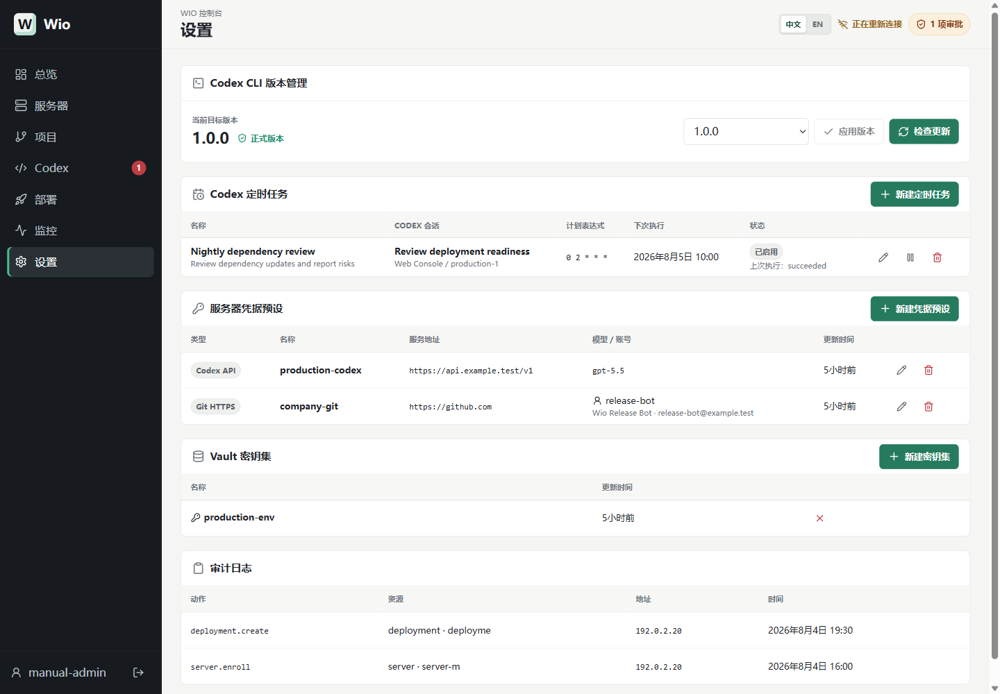

### 4.1 创建 Codex API 凭据预设

在 **设置 > 服务器凭据预设** 点击 **新建凭据预设**，选择 **Codex API**。

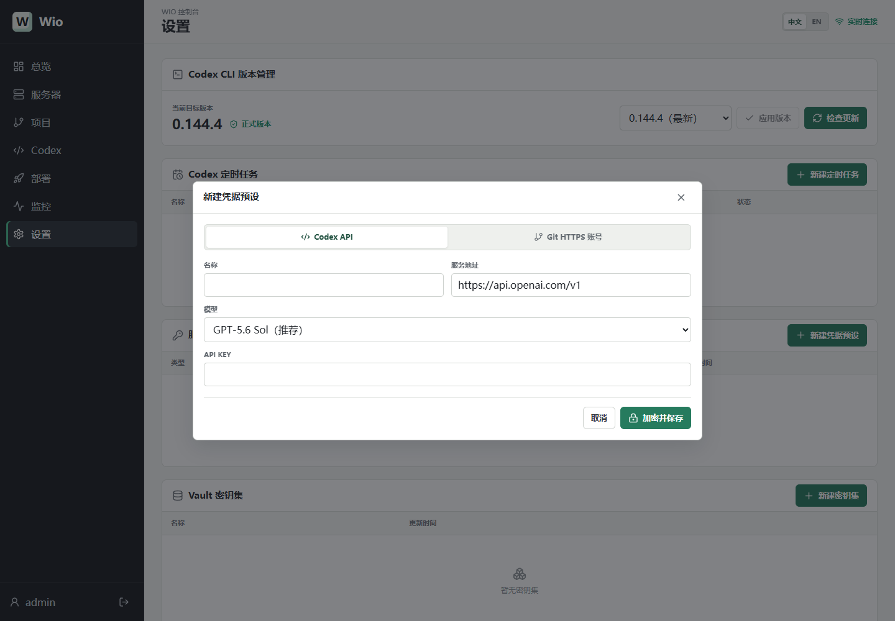

填写：

- **名称**：便于区分用途，例如 `生产 Codex`、`开发 Codex`。
- **服务地址**：填写兼容 Codex API 的服务地址。
- **模型**：从推荐模型中选择，或选择自定义模型并填写模型 ID。
- **API Key**：粘贴 API 密钥。

点击 **加密并保存** 后，列表只展示预设摘要，不回显密钥。创建后可以在注册服务器或服务器凭据编辑对话框中绑定它。

建议：

- 不要为不同环境复用一个无法追踪用途的预设名称。
- 轮换密钥时编辑原预设并重新绑定受影响服务器，完成后检查服务器上的 Codex 状态。
- 截图、工单和聊天记录中不要粘贴真实 API Key。

### 4.2 创建 Git HTTPS 账号预设

在同一个对话框切换到 **Git HTTPS 账号**，填写：

- 预设名称和 Git 服务地址。
- Git 用户名。
- Personal Access Token 或密码。
- **提交者姓名**和**提交者邮箱**。

提交者姓名和邮箱缺一不可。没有完整提交身份的 Git 预设不能在服务器上用于提交代码。公开仓库只读操作可以不绑定 Git 预设，但推送私有仓库或需要认证的远程操作时必须绑定。

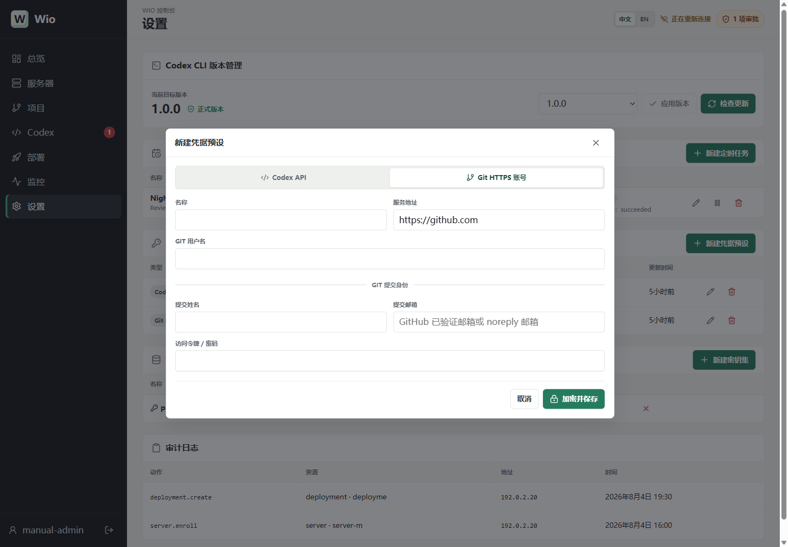

### 4.3 创建 Vault 密钥集

在 **设置 > Vault 密钥集** 点击 **新建密钥集**。

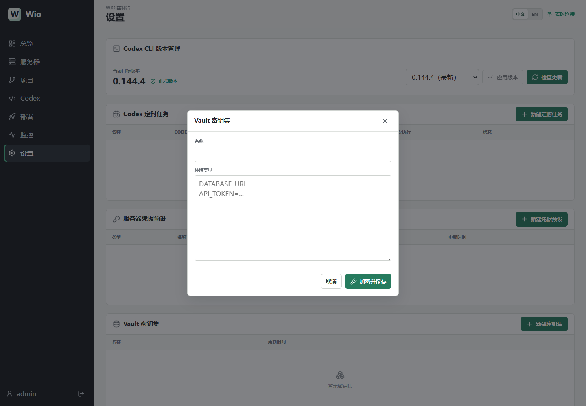

1. 输入密钥集名称，例如 `production-env`。
2. 在环境变量文本框中按“一行一个变量”的格式填写：

   ```text
   DATABASE_URL=...
   API_TOKEN=...
   APP_ENV=production
   ```

3. 点击 **加密并保存**。

密钥集只在部署时按目标配置使用。删除密钥集前，先确认没有部署目标依赖它；删除后，相关部署可能无法启动或重新部署。

### 4.4 管理 Codex CLI 版本

设置页顶部的 **Codex CLI 版本管理** 显示控制面当前目标版本：

1. 点击 **检查更新**，获取可用的稳定版本。
2. 在下拉框中选择版本。
3. 点击 **应用版本**，将目标版本写入控制面。
4. 再到具体服务器页面对在线服务器执行 Agent/Codex CLI 更新。

控制面目标版本和某台服务器实际已安装版本是两个层次。服务器离线、Agent 版本过旧或存在活动 Codex 会话时，更新按钮可能被禁用或排队。

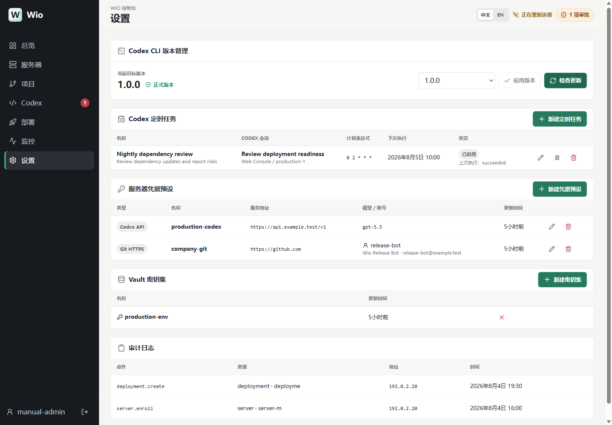

### 4.5 创建 Codex 定时任务

在 **设置 > Codex 定时任务** 点击 **新建定时任务**。

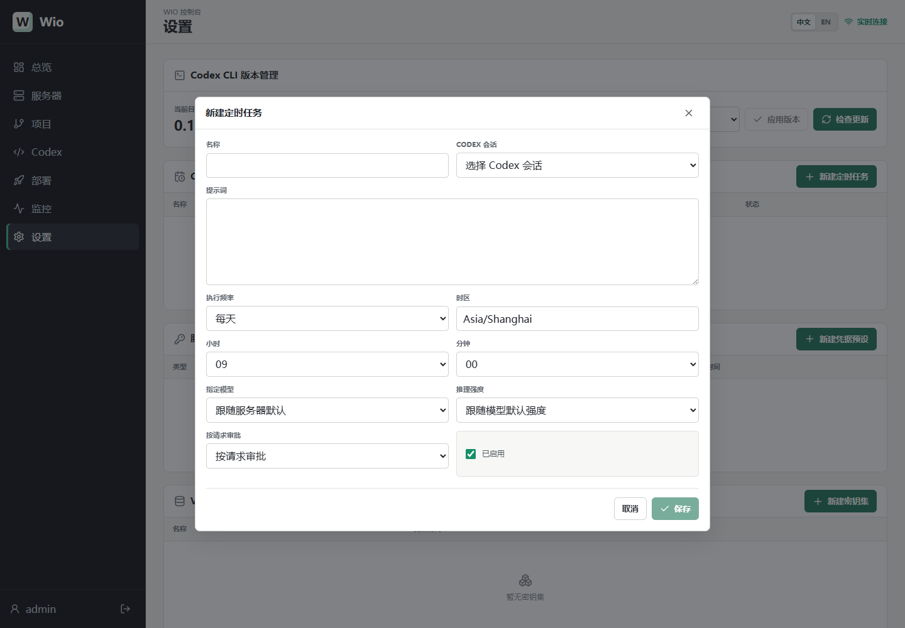

填写：

- 任务名称。
- 要复用的 Codex 会话。会话必须先存在，并且绑定有效工作区。
- 提示词：每次执行时发送给 Codex 的任务内容。
- 执行频率：每天、工作日、每周、每月、按间隔或自定义表达式。
- 时区，默认 `Asia/Shanghai`。
- 执行时间。
- 可选的模型和推理强度覆盖。
- 审批策略：按请求审批、不可信命令需审批或永不审批。
- 是否启用。

保存后可在列表中编辑、暂停/启用或删除。生产任务建议先用手动 Codex 会话验证提示词和权限，再启用定时执行。

### 4.6 审计日志

设置页底部的 **审计日志** 记录认证、服务器、项目、凭据、部署等关键管理动作。日志包含动作、资源、来源地址和时间，并支持继续加载更早记录。

审计日志适合用于：

- 确认谁在什么时间创建、删除或修改了资源。
- 排查“页面显示已提交但结果不符合预期”的操作链。
- 记录凭据轮换、服务器下线和部署回滚的时间点。


## 5. 服务器管理

### 5.1 注册 Linux 服务器

打开 **服务器** 页面，点击 **注册服务器**。

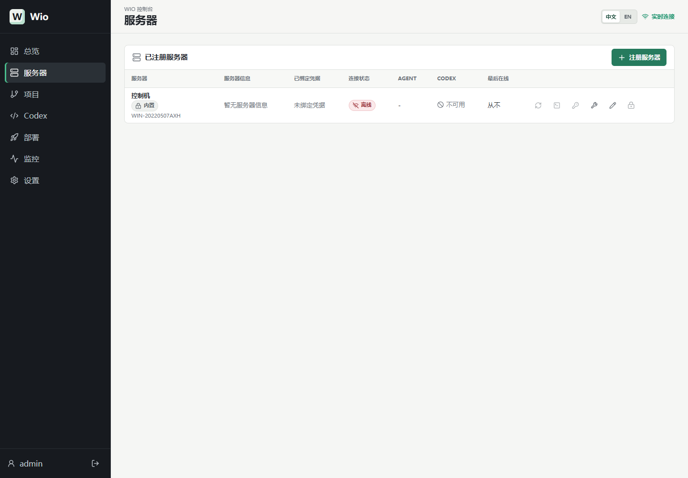

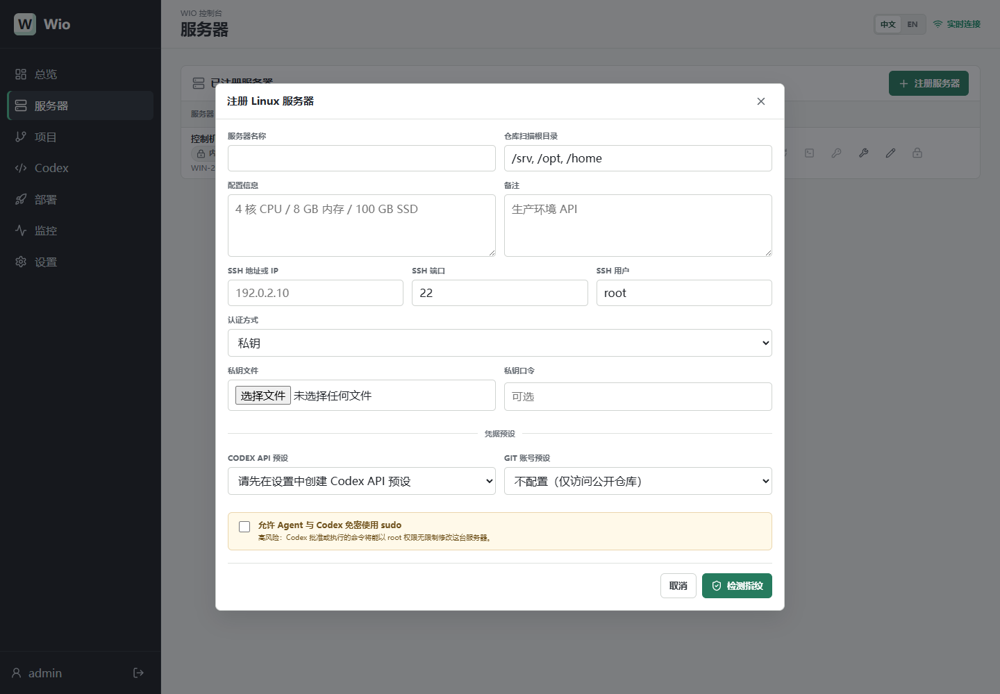

注册对话框按以下顺序填写：

1. **服务器名称**：填写容易识别的名称，例如 `prod-api-01`。
2. **仓库扫描根目录**：用逗号分隔目录，例如 `/srv, /opt, /home`。扫描已有项目时，Agent 只会从这些根目录下查找。
3. **配置信息**和**备注**：填写 CPU、内存、磁盘、用途、环境等便于运维识别的内容。
4. **SSH 地址或 IP**、**SSH 端口**、**SSH 用户**：使用可从控制面访问的地址；SSH 用户应为 `root`，或拥有无需交互输入密码的 `sudo` 权限。
5. 选择认证方式：
   - **私钥**：上传 `.pem`、`.key` 或文本格式私钥，可填写私钥口令。
   - **密码**：填写 SSH 登录密码。
6. 从下拉框选择要绑定的 Codex API 预设和 Git 账号预设。Codex 预设是必需项；不需要私有 Git 访问时可以选择不配置 Git。
7. 只有在充分理解风险并确有需要时，才勾选 **允许 Agent 与 Codex 免密使用 sudo**。
8. 点击 **检测指纹**。

### 5.2 校验 SSH 指纹并安装 Agent

检测指纹后，页面会显示目标主机的 SSH 指纹。将它与云厂商控制台、服务器管理员记录或主机侧可信信息进行比对；确认不是目标主机时不要继续安装。

指纹确认无误后，点击 **确认并安装**。安装日志会显示连接 SSH、检查 Linux 环境、上传 Agent、安装 systemd 服务、配置凭据、安装 Codex CLI/Playwright 和启动服务等步骤。

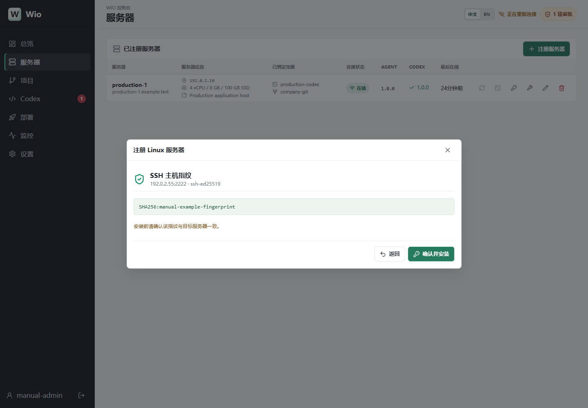

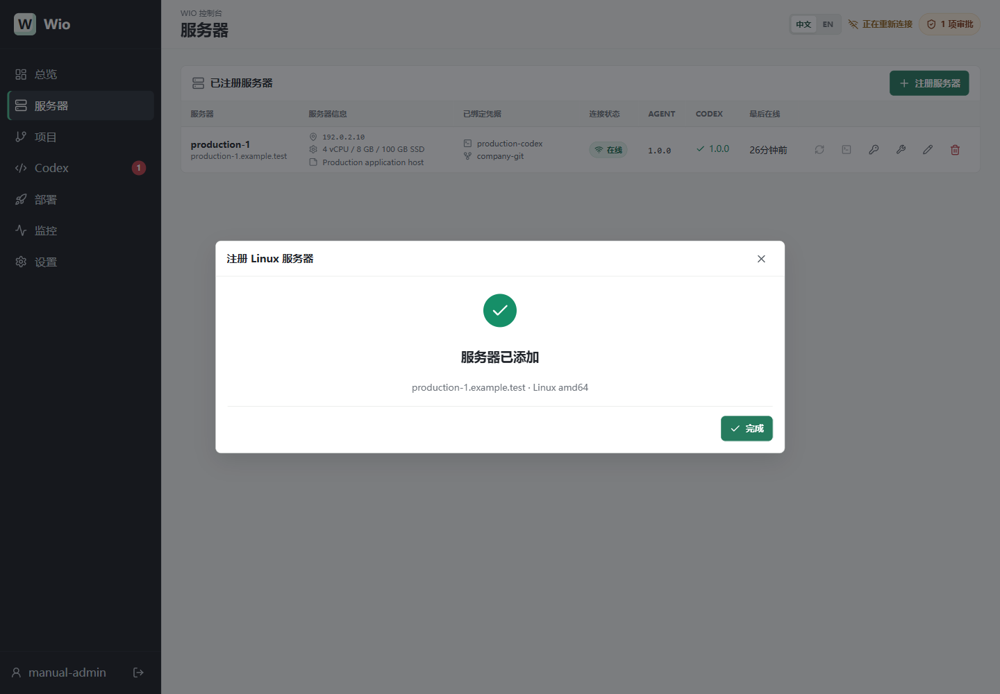

目标服务器需要满足：

- Linux、systemd 可用。
- SSH 用户为 root，或可免密 sudo。
- 服务器能够主动访问 Wio 控制面的 Agent 地址。
- 需要对应功能时，安装 Git、Docker Engine/Compose v2、Node.js/npm、Codex CLI。

注册成功后等待一次心跳和 inventory 上报。服务器显示 **在线** 后，再创建项目或部署目标。

### 5.3 检查服务器能力

服务器列表会展示：

- 连接状态和最后在线时间。
- Agent 版本与目标版本。
- Codex CLI 版本或不可用原因。
- 已绑定的 Codex/Git 凭据预设。
- Git、Docker、Compose、npm、Playwright 等能力告警。

缺少 Git 或 Docker 通常不会阻止服务器注册，但会使项目发现、Git 操作或部署功能显示为不可用。先处理能力告警，再重试对应操作。

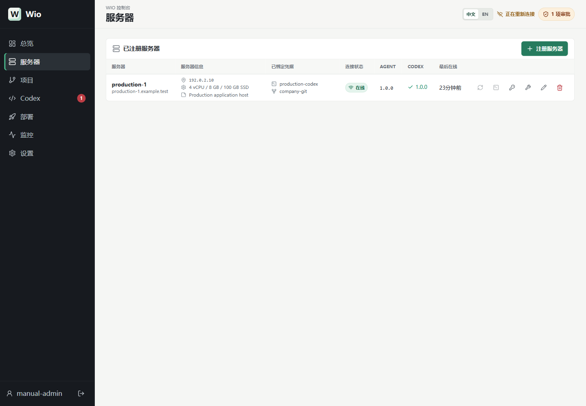

### 5.4 服务器后续操作

服务器行右侧的操作包括：

- **编辑服务器信息**：修改地址、硬件信息和备注等元数据。
- **修改服务器凭据**：服务器在线时重新绑定 Codex/Git 预设，密钥会加密后下发。
- **修复注册**：重新安装 Agent 和受限部署助手，同时保留服务器 ID、项目、工作区和部署目标。Wio 不保存 SSH 凭据，因此修复时需要重新提供。
- **升级 Agent**：将 Agent 升级到控制面选择的目标版本。
- **升级 Codex CLI**：服务器在线且 Agent 就绪时执行；有活动 Codex 会话时应先结束或等待。
- **撤销记录**：只删除 Wio 中的服务器记录，远端 Agent 和凭据文件可能仍保留。
- **彻底下线**：在校验指纹并重新提供 SSH 凭据后，卸载 Wio Agent、受限助手、服务账号和受管数据，同时删除 Wio 中关联记录。该操作不可恢复。

撤销和彻底下线不是同一个操作。需要释放服务器上的 Agent 和受管文件时，使用彻底下线，并在确认页逐字输入服务器名称。

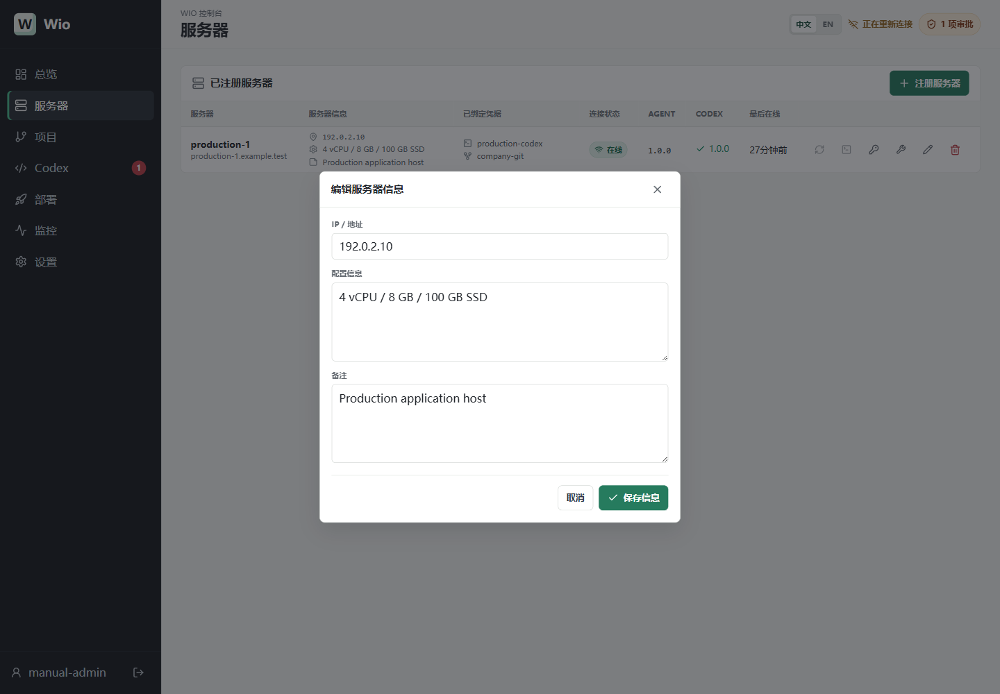

## 6. 项目与工作区

### 6.1 创建项目、克隆项目和扫描项目

打开 **项目** 页面，点击 **新建项目**。

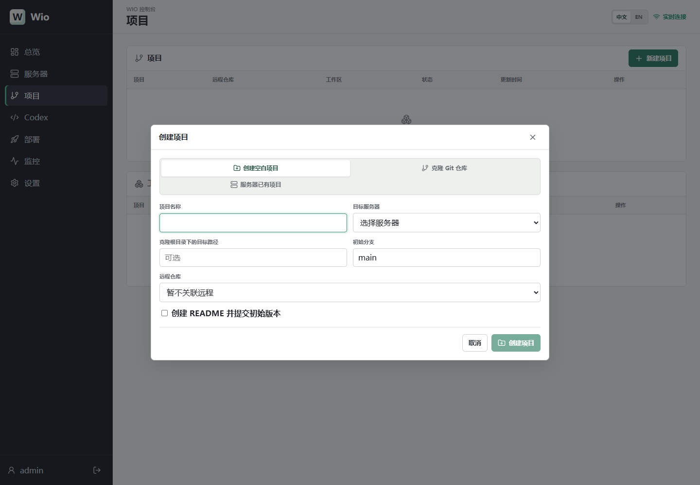

创建对话框提供三种方式：

#### 创建空白项目

适合从零开始：

1. 输入项目名称。
2. 选择在线目标服务器。
3. 可选填写克隆根目录下的目标路径；不填写时使用服务器默认根目录。
4. 填写初始分支，默认 `main`。
5. 选择暂不关联远程、关联已有远程，或新建远程仓库。
6. 如需立即生成初始文件，勾选 **创建 README 并提交初始版本**。
7. 点击 **创建项目**，随后在项目列表和操作历史中观察结果。

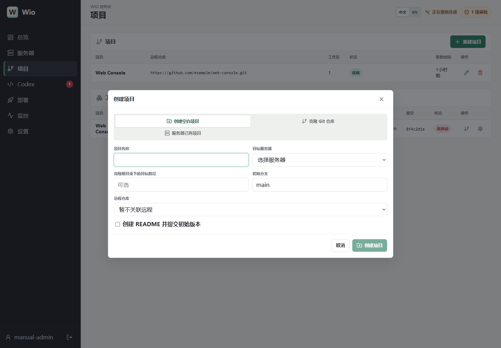

#### 克隆 Git 仓库

适合已有远程仓库：

1. 切换到 **克隆 Git 仓库**。
2. 选择目标服务器和目标路径。
3. 输入远程仓库 URL，设置初始分支或其他 Git 引用。
4. 私有仓库选择已经在设置中创建、并绑定到服务器的 Git 账号预设。
5. 提交导入后等待 Agent 执行，成功后会生成项目和工作区记录。

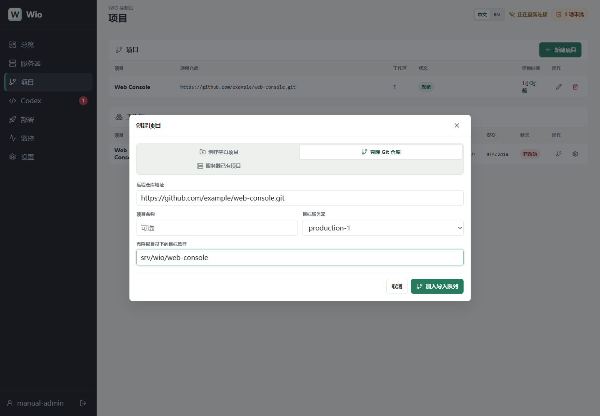

#### 服务器已有项目

适合将服务器上已经存在的 Git 目录纳管：

1. 切换到 **服务器已有项目**。
2. 选择要扫描的服务器。
3. 点击搜索/扫描，等待 Agent 根据扫描根目录返回项目。
4. 选择要导入的目录并提交。

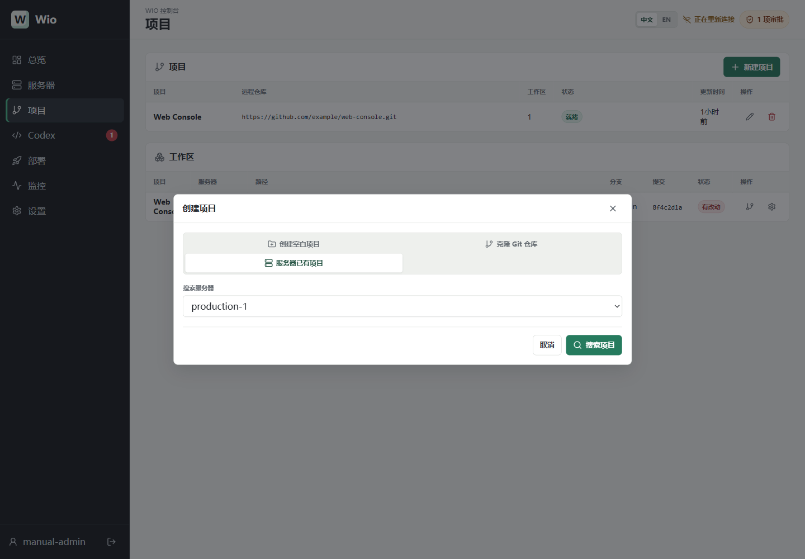

如果目标服务器离线、Git 缺失或扫描根目录没有权限，导入会排队或失败。不要在项目列表中重复创建同一路径；先修复服务器状态再重试。

### 6.2 关联或新建远程仓库

选择 **关联已有远程仓库** 时，填写远程 URL 并选择对应 Git 凭据。

选择 **新建远程仓库** 时，按页面填写 Git 服务商、命名空间、仓库名称和可见性。当前产品对 Gitee、GitHub、GitLab 有针对性支持；最终能否创建还取决于账号权限、服务商 API 和服务器网络。

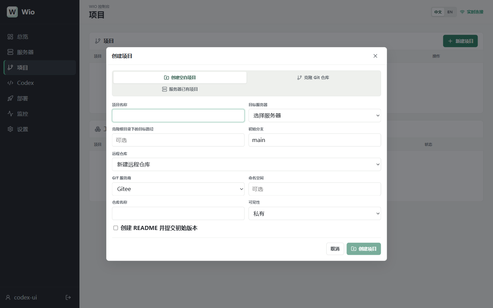

如果远程创建失败：

- 先检查服务商凭据是否有效、是否有创建仓库权限。
- 检查目标服务器能否访问 Git 服务商。
- 需要时先在服务商网页创建空仓库，再回到 Wio 选择“关联已有远程仓库”。

### 6.3 项目列表和项目详情

项目页上半部分是项目列表，下半部分是工作区列表。项目行通常可以打开项目详情或使用操作菜单。

项目详情支持：

- 修改项目描述。
- 修改默认分支。
- 置顶或取消置顶。
- 隐藏项目；隐藏后可以在项目页恢复。
- 归档和恢复项目。
- 查看项目操作历史及每次操作结果。
- 打开某个工作区的 Git 信息。

项目状态通常反映项目生命周期：创建中、就绪、部分可用、失败或已归档。项目显示就绪不等于所有工作区都在线，仍要单独查看工作区状态。

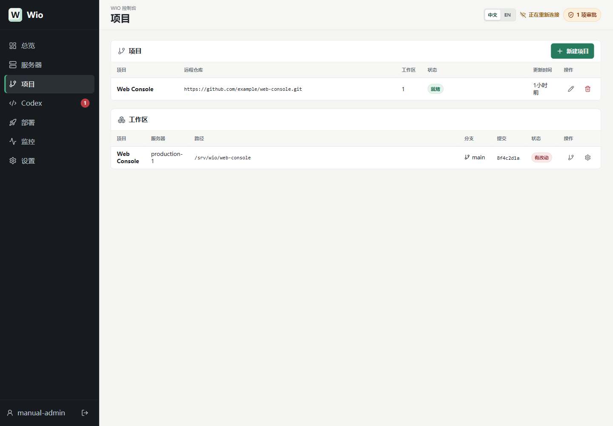

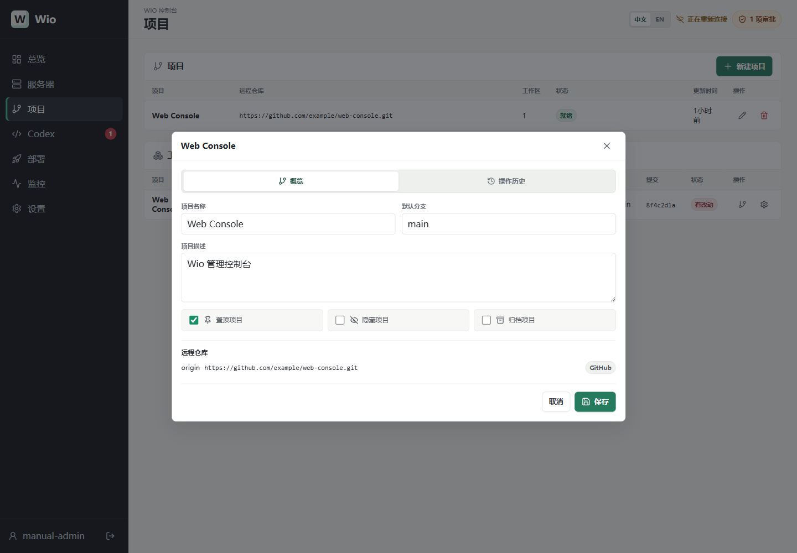

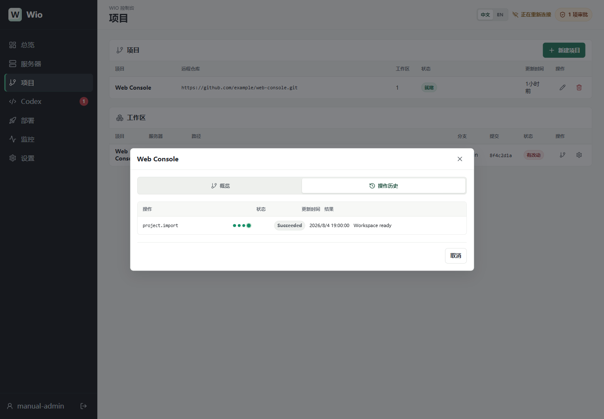

### 6.4 工作区管理

工作区行的管理入口提供：

- **重命名**：只修改 Wio 展示名称，不改变服务器目录。
- **移动**：将受管工作区移动到目标路径，可在支持的场景下移动到另一台服务器。
- **复制**：复制工作区，原工作区保留。
- **删除**：可选择仅删除 Wio 中的工作区记录，或删除受管目录后再删除记录。

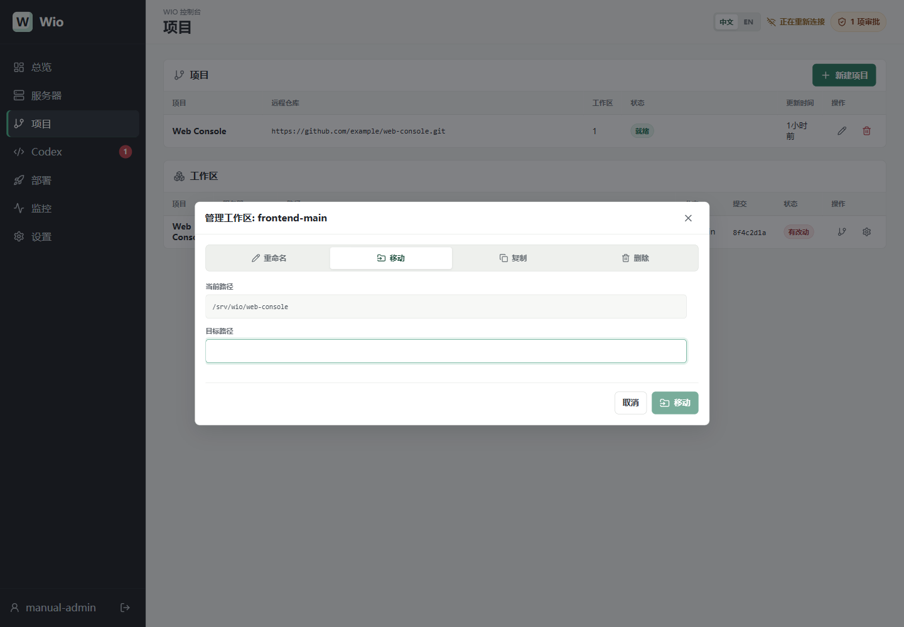

移动或复制前检查：

1. 目标路径必须明确且在允许的目录范围内。
2. 工作区不能有进行中的写操作、Codex 任务或部署。
3. 观察工作区通常不支持受管文件移动、复制和物理删除。
4. 跨服务器操作要求目标服务器在线，并且 Agent、权限和存储空间正常。

### 6.5 删除项目前的影响预检

点击项目删除后，Wio 会先展示删除影响预检，而不是立即删除。页面会统计工作区、受管/观察目录、进行中的操作、Codex 任务和部署。

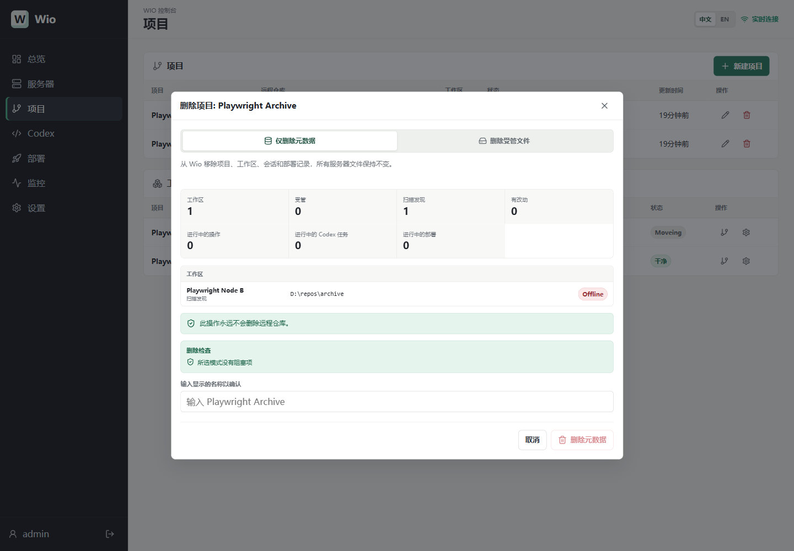

有两种模式：

- **仅删除元数据**：从 Wio 移除项目、工作区、会话和部署记录，服务器文件保留。
- **删除受管文件**：删除 Wio 管理的工作区目录，再清理对应记录。观察工作区存在时，项目记录可能保留。

远程仓库不会被此操作删除。只有确认预检没有阻塞项，并在输入框中逐字输入页面显示的项目名称后，删除按钮才会可用。删除受管文件不可恢复，执行前应另行备份需要保留的目录。

## 7. Git 工作流

### 7.1 查看 Git 信息

在工作区操作中打开 **Git 信息**，可以在以下视图之间切换：

- **状态**：工作区是否干净、当前分支、HEAD、上游分支、ahead/behind，以及 staged、unstaged、untracked 数量。
- **分支**：创建、切换、重命名和删除本地分支，查看远程分支，必要时显式选择 detached HEAD 或强制删除。
- **远程仓库**：查看、添加、编辑和删除 remote，设置 fetch/push 地址及默认 remote。
- **提交**：查看提交列表和单次提交详情。

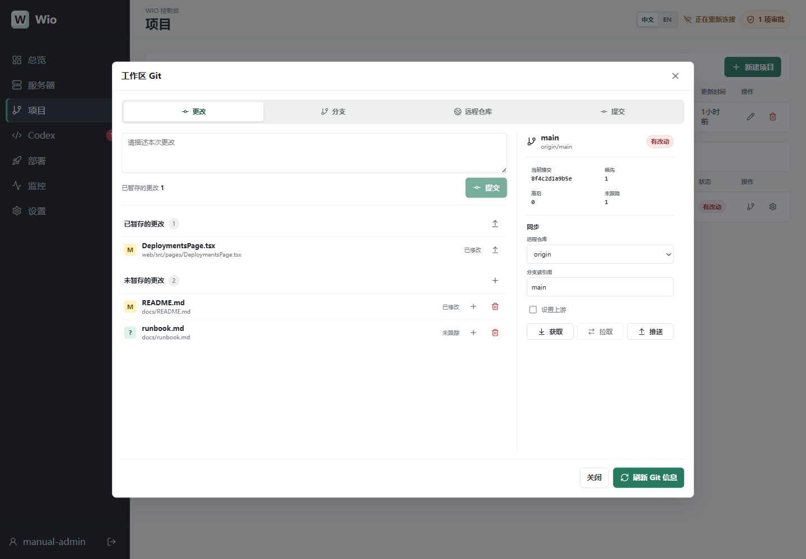

进入页面后先点击 **刷新 Git 信息**。如果服务器刚恢复在线，等待 Agent 上报完成后再刷新，避免读取到旧快照。

### 7.2 分支操作

创建分支：

1. 在“分支”视图输入分支名。
2. 选择起点，通常是当前 `HEAD` 或指定分支/提交。
3. 点击 **新建分支**。

切换分支：

1. 在切换区域输入或选择目标分支。
2. 如需切换到 detached HEAD，勾选相应选项。
3. 检查本地未提交改动；存在改动时先提交、暂存或另行备份。
4. 点击 **切换分支**。

删除分支时默认会阻止删除当前分支或可能丢失提交的分支。只有确认分支内容已处理后，才使用强制删除。

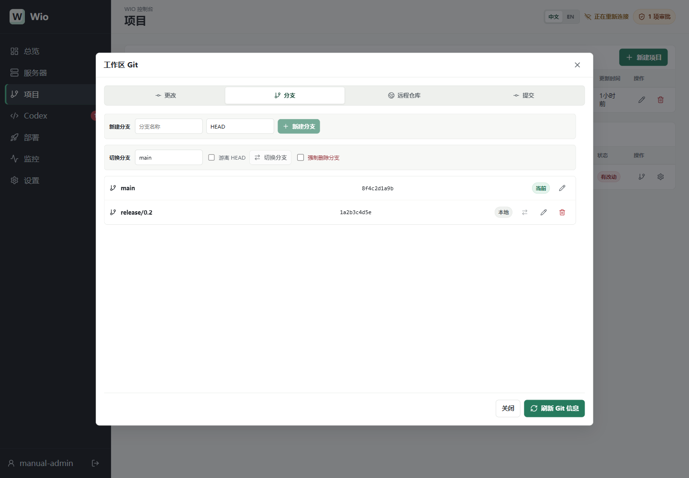

### 7.3 远程、同步和提交

- **Fetch**：只获取远程引用，不修改当前工作区文件。
- **Pull**：将远程更新合并或快进到当前分支。存在本地未提交改动时，Wio 会阻止 pull，先提交或处理改动。
- **Push**：将当前分支推送到 remote；首次推送时可设置 upstream。
- **Commit**：在 Codex 文件面板中填写提交说明并提交当前工作区改动。提交前确认提交者姓名和邮箱已经在 Git 凭据预设中配置。

所有 Git 写操作都由 Agent 在服务器上的真实仓库中执行。出现冲突、非 fast-forward、认证失败或远程不可达时，先阅读操作结果和错误信息，不要通过连续点击重复触发。

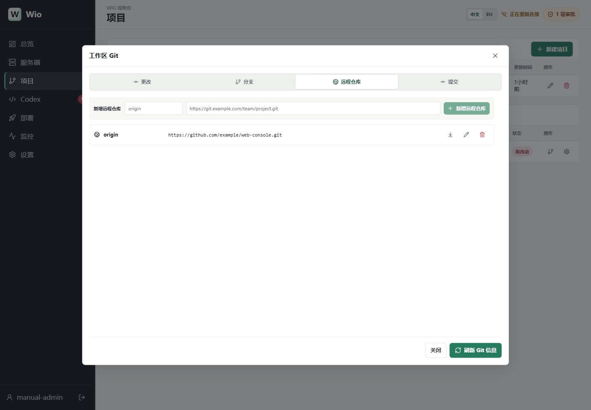

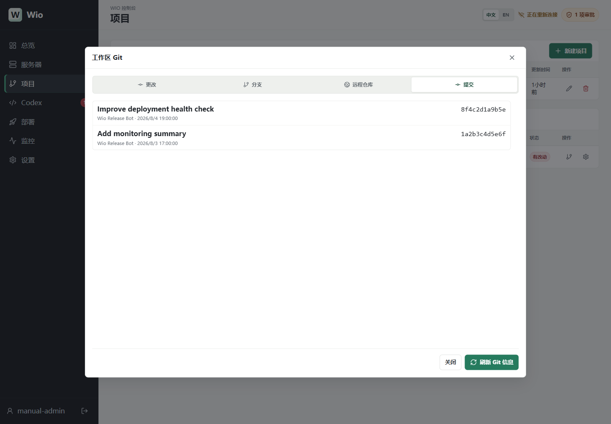

## 8. Codex 会话

### 8.1 创建会话的前提

Codex 会话需要同时满足：

- 项目至少有一个工作区。
- 目标服务器在线，Agent 能接受 Codex 操作。
- 服务器绑定有效的 Codex API 预设。
- 服务器上的 Codex CLI 已安装且版本可用。

如果 Codex 页面显示“选择工作区以开始会话”，先回到项目页创建或导入工作区。

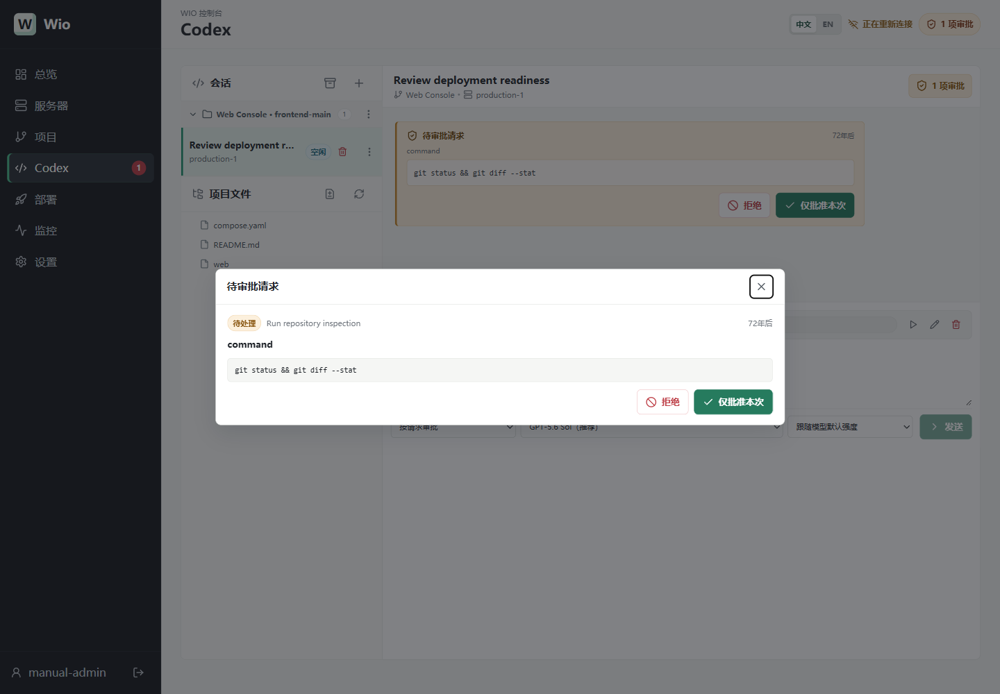

### 8.2 新建会话和发送任务

打开 **Codex** 页面，点击 **新建 Codex 会话**，选择工作区。会话列表会按项目和工作区分组。

在右侧输入框中输入任务并发送。可以：

- 使用自然语言描述目标、约束、验收方式和需要修改的目录。
- 一次附加最多 4 张 PNG、JPEG 或 WebP 图片。
- 在发送前选择模型覆盖和推理强度。
- 选择审批策略：按请求审批、不可信命令需审批或永不审批。

建议将一个可验证的目标拆成较小任务，并在提示词中明确“先检查再修改”“不要修改哪些文件”等边界。长任务可以使用目标（Goal）记录目标、状态和 Token 预算。

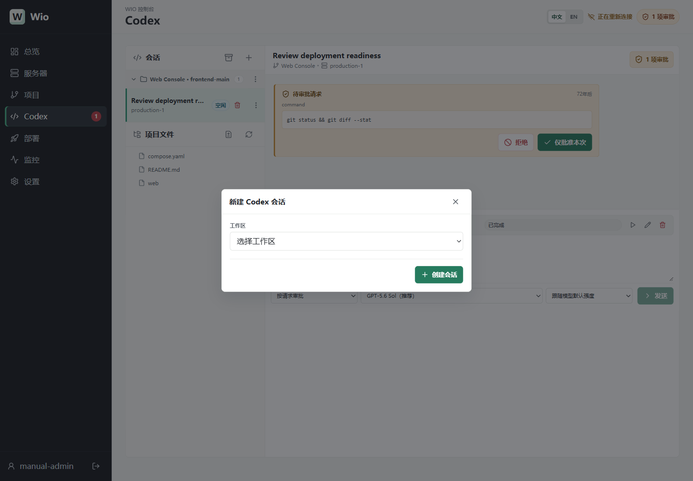

### 8.3 模型、推理强度和审批

会话输入区提供模型和推理强度选择：

- 服务器默认模型：遵循服务器绑定的 Codex 配置。
- Sol、Terra、Luna、GPT-5.5：按任务复杂度、速度和成本选择。
- 自定义模型：仅在服务地址支持并且模型 ID 正确时使用。
- 推理强度：低、中、高、极高、最大，或跟随模型默认强度。

审批策略会影响 Codex 遇到命令或敏感操作时的行为。收到审批请求时，Codex 页面会出现待审批提示：

- **批准一次**：只允许当前请求。
- **拒绝**：阻止当前请求。

在生产服务器上不建议默认选择“永不审批”。如果为 Agent/Codex 开启免密 sudo，Codex 批准或执行的命令可能拥有 root 级修改能力，应仅对可信任务和隔离环境使用。


### 8.4 会话状态、改写和中断

会话标题区显示项目、服务器和当前状态。常用操作包括：

- 重命名、置顶/取消置顶任务。
- 编辑自己已经发送的消息并重新提交。
- 继续到新任务，保留原任务历史。
- 创建独立 Git worktree，再在新工作区继续任务。
- 归档、恢复或删除任务。
- 复制工作目录、Wio 会话 ID、Codex 会话 ID或深链接。

运行中的任务可以点击中断。中断后看到 `interrupted` 表示任务被停止，并不表示服务器或仓库回滚；请检查文件变更和 Git 状态。

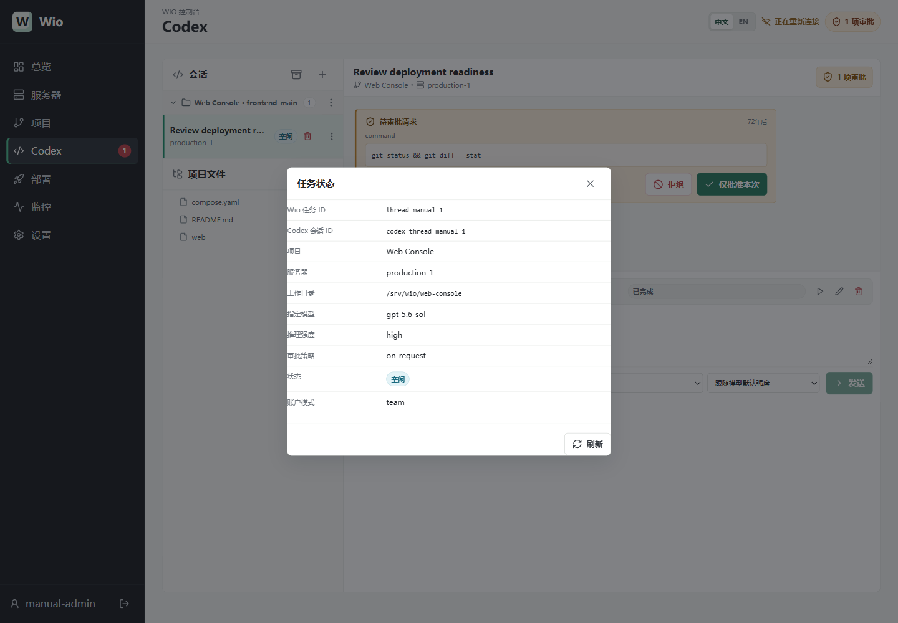

### 8.5 项目文件、预览和 diff

Codex 页面左侧的 **项目文件** 面板支持：

- 展开工作区文件树。
- 切换到 **文件变更**，查看 modified、added、deleted、renamed、untracked 和 conflict。
- 刷新文件扫描和变更扫描。
- 打开文本文件预览，查看语法高亮、文件大小和截断提示。
- 打开变更 diff，查看增删行并在可写工作区中丢弃单个文件改动。

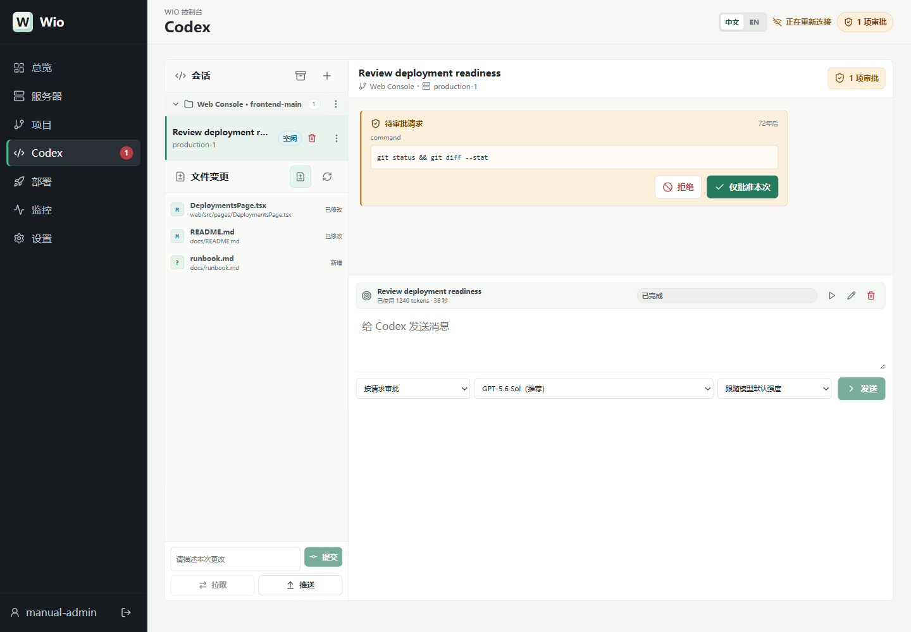

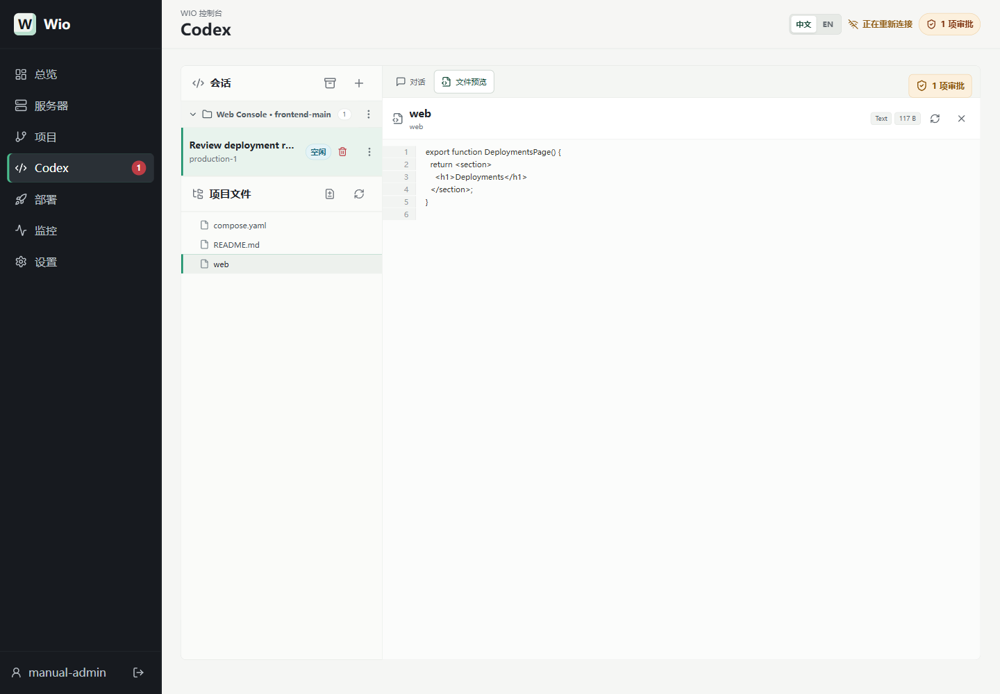

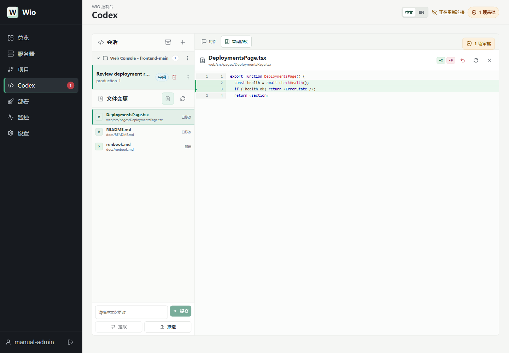

文件预览和 diff 默认通过 Agent 请求。服务器离线、文件超过预览限制或请求超时会保留上一次成功数据，并显示失败原因和重试入口。丢弃改动不可恢复，使用前确认文件路径和目标工作区。

在文件面板中还可以：

- 填写提交说明并提交所有当前改动。
- 当工作区干净且配置了 remote 时执行 pull。
- 执行 push，首次推送时自动设置 upstream。

## 9. Docker Compose 部署

### 9.1 创建部署目标

打开 **部署** 页面，点击 **新建目标**。

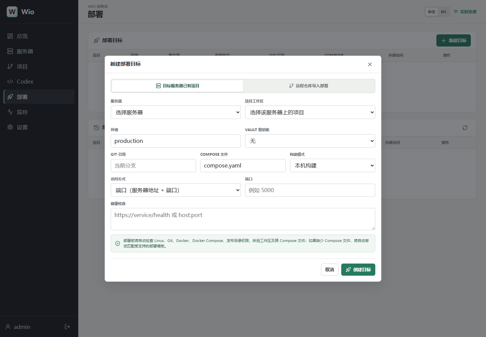

部署来源有两种：

- **目标服务器已有项目**：从已存在的工作区部署。
- **远程仓库导入部署**：部署时从远程仓库获取代码。

填写以下配置：

1. 服务器和项目工作区，或远程仓库 URL。
2. 环境名称，例如 `production` 或 `staging`。
3. 可选的 Vault 密钥集。
4. Git 引用，工作区来源默认使用当前分支，远程来源通常填 `main` 或 tag。
5. Compose 文件名，默认 `compose.yaml`。
6. 构建模式：**本机构建** 或 **拉取镜像**。
7. 外部访问方式：端口或域名；填写端口后页面会预览服务器地址和端口组成的访问地址。
8. 健康检查地址，每行一个，例如 `https://service/health` 或 `host:port`。

提交部署目标时，Wio 会自动预检 Linux、Git、Docker、Docker Compose、发布目录权限、工作区和 Compose 文件；缺少 Compose 文件时会尝试匹配受支持的部署模板。

### 9.2 执行部署和查看日志

部署目标创建后，在目标行点击 **部署**。Wio 会记录提交引用、实际解析到的 commit、开始/结束时间、耗时、状态、消息和外部访问地址。

点击部署历史中的日志图标可查看事件时间线，包括准备、构建、拉取镜像、启动 Compose、健康检查和结束结果。失败时先看最后一个失败事件的内容，再处理权限、网络、Compose 文件或镜像问题。


### 9.3 管理容器生命周期

部署目标行提供容器操作：

- **启动 / 停止**：启动或停止当前 Compose 应用。
- **重启**：重启容器。
- **移除**：移除当前容器资源，执行前确认不会影响需要保留的数据卷。
- **回滚**：使用上一次成功部署的版本重新部署。
- **编辑目标**：修改工作区、Git 引用、Compose 文件、访问方式和健康检查。
- **删除目标**：删除 Wio 中的部署目标配置；删除前先确认没有需要保留的部署历史。

运行中的容器操作和部署操作会互相锁定。等待当前操作结束后再执行下一项。

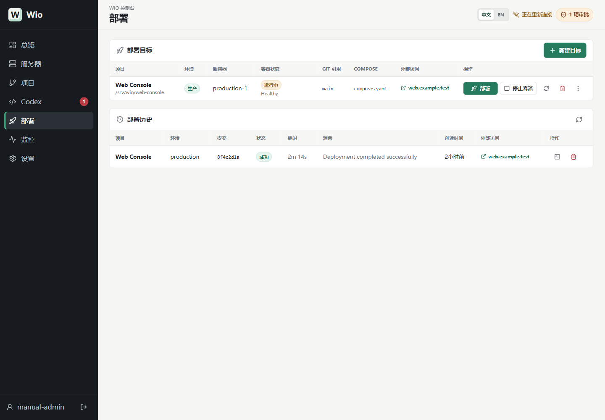

## 10. 监控和告警

### 10.1 查看服务器资源

打开 **监控** 页面，选择服务器和时间范围：1 小时、6 小时、24 小时或 7 天。

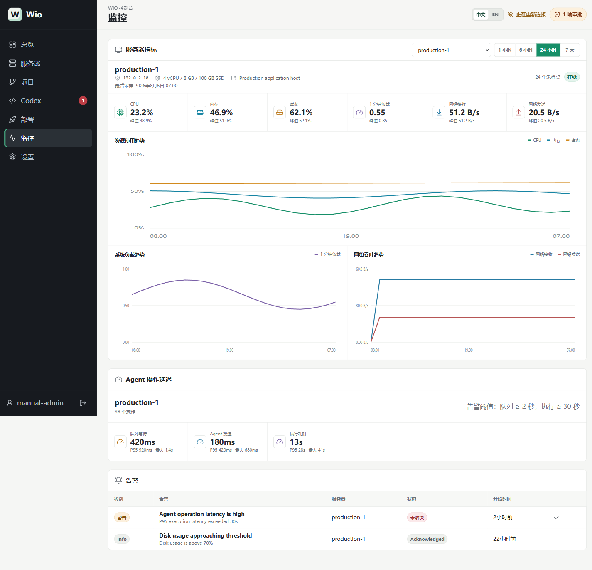

页面显示：

- CPU 使用率及峰值。
- 内存使用率及峰值。
- 磁盘使用率及峰值。
- 1 分钟负载及峰值。
- 网络接收和发送速率。
- 资源使用、系统负载和网络吞吐趋势图。

将鼠标移动到图表上可以查看某个时间点的详细数值。页面按当前时间范围对大量采样点进行下采样，趋势图用于观察变化，不应当替代服务器侧的精确诊断工具。

显示“等待首次指标采样”时，先确认：

1. 服务器在线且 Agent 已启动。
2. Agent 能回连控制面。
3. 控制面与服务器的时间没有明显偏差。
4. 已经等待至少一个采样周期并刷新页面。

### 10.2 Agent 操作延迟

监控页的 **Agent 操作延迟** 分别展示队列等待、Agent 投递和执行耗时，并给出平均值、P95 和最大值。页面默认使用队列等待达到 2 秒、执行达到 30 秒作为告警参考阈值。

延迟突然升高时，按“服务器在线状态 → Agent 最近心跳 → 最近操作日志 → 服务器 CPU/磁盘/网络”顺序排查。

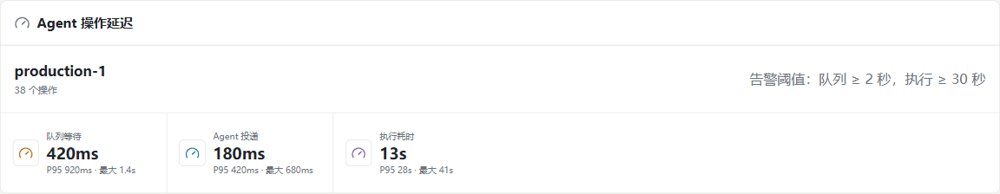

### 10.3 告警确认

告警表展示级别、告警标题、服务器、状态和开始时间。确认已经处理后，点击该行的确认图标。确认只会改变 Wio 中的告警处理状态，不会自动修复服务器问题；修复动作仍需按告警内容执行。

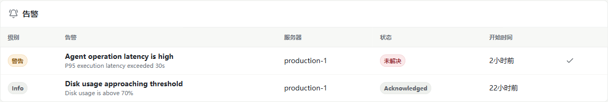

## 11. 安全和运维建议

1. 生产环境使用 HTTPS，并设置正确的公开访问 URL；不要用开发环境的 insecure 配置承载真实凭据。
2. 首次配置后将 TOTP 恢复码保存到服务器之外，并定期验证恢复流程。
3. 通过设置中的凭据预设统一管理 Codex/Git 凭据，避免把 Token 写进仓库文件、Compose 文件或 Codex 提示词。
4. 只对确有需要的服务器开启 Agent/Codex 免密 sudo，优先在非生产或受控工作区验证任务。
5. 删除项目时优先选择“仅删除元数据”进行清理；只有明确需要删除受管目录时才选择“删除受管文件”。
6. 生产部署前固定 Git commit 或 tag，不要长期依赖移动中的分支。
7. 为每个环境使用独立的 Vault 密钥集和部署目标，降低误部署风险。
8. 关注审计日志、部署日志和 Agent 操作延迟，发现异常时保留时间点、服务器、项目和操作 ID。
9. 定期备份控制面数据库、生产 PostgreSQL 和重要工作区；Wio 的删除确认不能替代备份。
10. 操作失败后先修复前置条件，再点击重试；同一个工作区不要并行发起多个写操作。

本手册走查中提出的后续体验调整，已独立整理为 [Wio 用户体验调整计划](USER_GUIDE_ADJUSTMENT_PLAN.md)。

## 附录：最短操作路径

### 从零开始管理一个项目

1. 设置中创建 Codex API 预设，必要时创建 Git 预设。
2. 服务器中注册 Linux 主机，核对 SSH 指纹并安装 Agent。
3. 等待服务器在线并处理能力告警。
4. 项目中选择创建空白项目、克隆远程仓库或扫描已有项目。
5. 打开工作区 Git 信息，刷新状态并确认分支/远程。
6. Codex 中选择工作区，新建会话并设置审批策略。
7. 需要发布时，在设置中准备 Vault 密钥集，在部署中创建目标。
8. 执行部署并查看日志、容器状态和健康检查。
9. 监控中选择服务器和时间范围，确认指标与告警。

### 需要安全清理一个项目

1. 先停止或等待该项目的 Codex 任务、Git 写操作和部署完成。
2. 在项目详情查看工作区和操作历史。
3. 打开删除预检，确认远程仓库不会被删除。
4. 不需要删除服务器文件时选择“仅删除元数据”。
5. 需要清理受管目录时选择“删除受管文件”，核对列表和阻塞项。
6. 逐字输入项目名称后确认，并在审计日志中保留操作记录。
